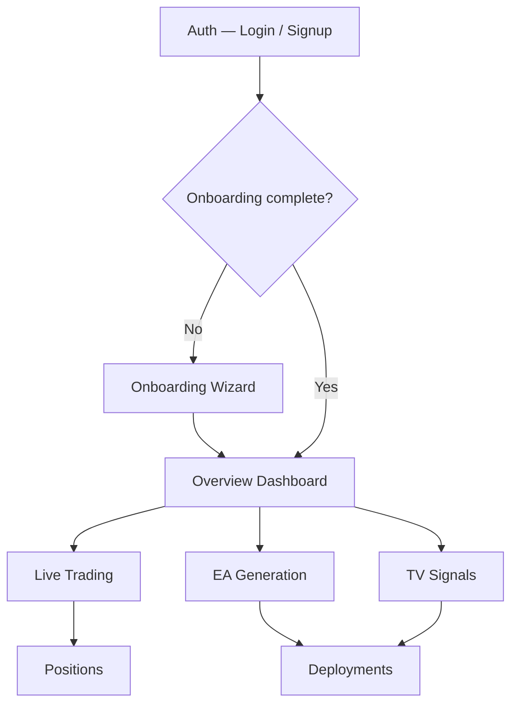

# Core Flows — ForexElite Pro

## Overview

Five core flows cover the complete user journey through ForexElite Pro — from first visit to running automated strategies. Each flow is self-contained but they connect sequentially: a user must complete Auth → Onboarding before any trading flow becomes accessible.

---

## Flow 1 — Authentication

**Entry:** User visits the app for the first time, or their session has expired.

**Steps:**
1. User lands on the Auth page — a full-viewport dark screen with a live price ticker marquee (EURUSD, GBPUSD, XAUUSD, USDJPY) scrolling at the bottom. No login required to see prices.
2. User enters email and password. The form validates inline as they type.
3. On submit, the button shows a spinner and disables. An invalid credential shows a shake animation on the form and a toast error.
4. On success, the app silently checks whether the user has completed onboarding.
5. If onboarding is complete → redirect to `/dashboard`. If not → redirect to `/onboarding`.
6. Signup follows the same page with a toggle link. After signup, the user is always sent to `/onboarding`.

**Exit:** User reaches either `/dashboard` or `/onboarding`.

```wireframe
<!DOCTYPE html>
<html>
<head>
<style>
  * { box-sizing: border-box; margin: 0; padding: 0; font-family: sans-serif; }
  body { background: #070D1B; color: #EEF2FF; min-height: 100vh; display: flex; flex-direction: column; align-items: center; justify-content: center; }
  .logo { font-size: 22px; font-weight: 900; letter-spacing: 2px; margin-bottom: 32px; color: #C9A84C; }
  .logo span { background: #C9A84C; color: #070D1B; padding: 2px 6px; font-size: 11px; margin-left: 6px; border-radius: 3px; vertical-align: middle; }
  .card { background: #090F1E; border: 1px solid #131E32; border-radius: 10px; padding: 36px 40px; width: 380px; }
  .title { font-size: 26px; font-weight: 900; letter-spacing: 1px; margin-bottom: 4px; }
  .subtitle { color: #8899BB; font-size: 13px; margin-bottom: 28px; }
  label { display: block; font-size: 12px; color: #8899BB; margin-bottom: 6px; margin-top: 16px; }
  input { width: 100%; background: #0C1525; border: 1px solid #131E32; border-radius: 6px; padding: 10px 12px; color: #EEF2FF; font-size: 14px; }
  .btn { width: 100%; margin-top: 24px; background: #C9A84C; color: #070D1B; border: none; border-radius: 6px; padding: 12px; font-size: 14px; font-weight: 700; cursor: pointer; letter-spacing: 1px; }
  .link { text-align: center; margin-top: 16px; font-size: 13px; color: #8899BB; }
  .link a { color: #C9A84C; text-decoration: none; }
  .ticker { position: fixed; bottom: 0; left: 0; right: 0; background: #090F1E; border-top: 1px solid #131E32; padding: 8px 24px; display: flex; gap: 32px; font-size: 12px; font-family: monospace; color: #8899BB; }
  .ticker .up { color: #00E5A0; }
</style>
</head>
<body>
  <div class="logo">FOREXELITE <span>PRO</span></div>
  <div class="card">
    <div class="title">WELCOME BACK</div>
    <div class="subtitle">Sign in to your trading desk</div>
    <label>Email</label>
    <input type="email" placeholder="trader@example.com" data-element-id="email-input" />
    <label>Password</label>
    <input type="password" placeholder="••••••••" data-element-id="password-input" />
    <button class="btn" data-element-id="signin-btn">SIGN IN</button>
    <div class="link">Don't have an account? <a href="#" data-element-id="signup-link">Sign up</a></div>
  </div>
  <div class="ticker">
    <span>EURUSD <span class="up">1.08428 ▲</span></span>
    <span>GBPUSD <span class="up">1.26910 ▲</span></span>
    <span>XAUUSD <span class="up">2034.50 ▲</span></span>
    <span>USDJPY 149.82</span>
  </div>
</body>
</html>
```

---

## Flow 2 — Onboarding Wizard

**Entry:** User has just signed up, or is redirected from any trading endpoint before completing setup.

**Steps:**
1. User sees a 3-step progress indicator at the top. Steps are linear — they cannot skip forward.
2. **Step 1 — Connect MT5:** User enters broker name, MT5 account number, account type (Demo / Live), and an optional label. They click "Test Connection". A spinner runs while the backend verifies the MT5 Agent is reachable. Success advances to Step 2; failure shows an inline error with a retry button.
3. **Step 2 — Risk Configuration:** User sets max risk per trade (slider, default 1%), preferred currency pairs (multi-select chips), and a daily loss limit. They click "Continue".
4. **Step 3 — Disclaimer:** A scrollable legal text block is shown. The "Complete Setup" button is disabled until the user has scrolled to the bottom and checked both acknowledgement boxes.
5. On completion, a confetti animation plays and a welcome toast appears. User is redirected to `/dashboard`.

**Exit:** User reaches the Overview Dashboard.

```wireframe
<!DOCTYPE html>
<html>
<head>
<style>
  * { box-sizing: border-box; margin: 0; padding: 0; font-family: sans-serif; }
  body { background: #070D1B; color: #EEF2FF; min-height: 100vh; }
  .topbar { background: #090F1E; border-bottom: 1px solid #131E32; padding: 14px 32px; display: flex; justify-content: space-between; align-items: center; }
  .logo { font-size: 16px; font-weight: 900; color: #C9A84C; letter-spacing: 2px; }
  .step-label { font-size: 12px; color: #8899BB; }
  .content { max-width: 600px; margin: 48px auto; padding: 0 24px; }
  .steps { display: flex; align-items: center; gap: 0; margin-bottom: 40px; }
  .step { display: flex; flex-direction: column; align-items: center; flex: 1; }
  .step-dot { width: 28px; height: 28px; border-radius: 50%; display: flex; align-items: center; justify-content: center; font-size: 12px; font-weight: 700; }
  .step-dot.done { background: #C9A84C; color: #070D1B; }
  .step-dot.active { background: #C9A84C; color: #070D1B; }
  .step-dot.todo { background: #131E32; color: #8899BB; border: 1px solid #131E32; }
  .step-name { font-size: 11px; color: #8899BB; margin-top: 6px; }
  .step-line { flex: 1; height: 2px; background: #131E32; margin-bottom: 20px; }
  .step-line.done { background: #C9A84C; }
  .card { background: #090F1E; border: 1px solid #131E32; border-radius: 10px; padding: 36px; }
  .card-title { font-size: 20px; font-weight: 900; letter-spacing: 1px; margin-bottom: 6px; }
  .card-sub { font-size: 13px; color: #8899BB; margin-bottom: 28px; }
  label { display: block; font-size: 12px; color: #8899BB; margin-bottom: 6px; margin-top: 16px; }
  input, select { width: 100%; background: #0C1525; border: 1px solid #131E32; border-radius: 6px; padding: 10px 12px; color: #EEF2FF; font-size: 14px; }
  .radio-group { display: flex; gap: 12px; margin-top: 8px; }
  .radio-opt { background: #0C1525; border: 1px solid #131E32; border-radius: 6px; padding: 8px 20px; font-size: 13px; cursor: pointer; }
  .radio-opt.selected { border-color: #C9A84C; color: #C9A84C; }
  .actions { display: flex; justify-content: space-between; margin-top: 32px; }
  .btn-primary { background: #C9A84C; color: #070D1B; border: none; border-radius: 6px; padding: 11px 28px; font-size: 14px; font-weight: 700; cursor: pointer; }
  .btn-ghost { background: transparent; color: #8899BB; border: 1px solid #131E32; border-radius: 6px; padding: 11px 20px; font-size: 14px; cursor: pointer; }
  .btn-outline { background: transparent; color: #C9A84C; border: 1px solid #C9A84C; border-radius: 6px; padding: 11px 20px; font-size: 14px; cursor: pointer; }
</style>
</head>
<body>
  <div class="topbar">
    <div class="logo">FOREXELITE <span style="background:#C9A84C;color:#070D1B;padding:2px 5px;font-size:10px;border-radius:3px;margin-left:4px;">PRO</span></div>
    <div class="step-label">Step 1 of 3</div>
  </div>
  <div class="content">
    <div class="steps">
      <div class="step">
        <div class="step-dot active">1</div>
        <div class="step-name">Connect MT5</div>
      </div>
      <div class="step-line"></div>
      <div class="step">
        <div class="step-dot todo">2</div>
        <div class="step-name">Risk Config</div>
      </div>
      <div class="step-line"></div>
      <div class="step">
        <div class="step-dot todo">3</div>
        <div class="step-name">Disclaimer</div>
      </div>
    </div>
    <div class="card">
      <div class="card-title">CONNECT YOUR MT5 ACCOUNT</div>
      <div class="card-sub">Link your MetaTrader 5 broker account to get started</div>
      <label>Broker Name</label>
      <input type="text" placeholder="e.g. Exness Global" data-element-id="broker-name" />
      <label>Account Number</label>
      <input type="text" placeholder="12345678" data-element-id="account-number" />
      <label>Account Type</label>
      <div class="radio-group">
        <div class="radio-opt" data-element-id="type-demo">Demo</div>
        <div class="radio-opt selected" data-element-id="type-live">Live</div>
      </div>
      <label>Label (optional)</label>
      <input type="text" placeholder="My Main Account" data-element-id="account-label" />
      <div class="actions">
        <button class="btn-outline" data-element-id="test-connection">Test Connection</button>
        <button class="btn-primary" data-element-id="continue-btn">Continue →</button>
      </div>
    </div>
  </div>
</body>
</html>
```

---

## Flow 3 — EA Generation

**Entry:** User navigates to EA Studio from the sidebar. They land on the Generate tab by default.

**Steps:**
1. User sees a two-panel layout: strategy description textarea on the left, code preview panel on the right (empty on first visit).
2. User types a plain-English strategy description. A live character counter updates. Quick-template buttons (MA Cross, RSI Reversion, Breakout, Scalping, Grid) pre-fill the textarea.
3. User clicks **Generate MQL5**. The code panel shows a 7-step animated progress sequence ("Parsing strategy…", "Generating indicator logic…", etc.).
4. Generated MQL5 code appears in the code panel, labelled **v1 — draft**. The code is locked by default — a red lock banner is visible. An unsaved dot (●) appears in the toolbar.
5. **Regenerating:** If the user edits the description and clicks Generate again, a new version is created automatically (v1 → v2). The previous version is preserved and accessible from a version dropdown in the toolbar. No confirmation dialog — this is non-destructive.
6. User can click **✎ Edit** to unlock the code and make manual changes. Clicking **🔒 Lock** re-locks it. Switching tabs within EA Studio auto-saves the draft silently. Navigating away from the page with unsaved changes shows a warning dialog.
7. User clicks **💾 Save to Library** — the EA is saved as a named project and appears in the Library tab.
8. User clicks **Compile .ex5** — a spinner runs while the MT5 Agent compiles. On success, the **Deploy to MT5** button activates. On failure, a dialog shows the compiler errors.
9. User clicks **Deploy to MT5** — a dialog asks them to select an Agent and a symbol. On confirm, they are navigated to the Deployments page.

**Exit:** User reaches the Deployments page, or saves the EA to the Library for later use.

```wireframe
<!DOCTYPE html>
<html>
<head>
<style>
  * { box-sizing: border-box; margin: 0; padding: 0; font-family: sans-serif; }
  body { background: #070D1B; color: #EEF2FF; display: flex; height: 100vh; }
  .sidebar { width: 200px; background: #090F1E; border-right: 1px solid #131E32; padding: 20px 0; flex-shrink: 0; }
  .sidebar-logo { padding: 0 16px 20px; font-size: 13px; font-weight: 900; color: #C9A84C; letter-spacing: 2px; }
  .sidebar-section { padding: 8px 16px 4px; font-size: 10px; color: #3F5070; letter-spacing: 1px; text-transform: uppercase; }
  .sidebar-item { padding: 8px 16px; font-size: 13px; color: #8899BB; cursor: pointer; }
  .sidebar-item.active { color: #EEF2FF; background: #0C1525; border-left: 2px solid #C9A84C; }
  .main { flex: 1; display: flex; flex-direction: column; overflow: hidden; }
  .topbar { background: #090F1E; border-bottom: 1px solid #131E32; padding: 12px 24px; display: flex; align-items: center; justify-content: space-between; }
  .page-title { font-size: 16px; font-weight: 900; letter-spacing: 1px; }
  .badge { background: #0C1525; border: 1px solid #131E32; border-radius: 4px; padding: 3px 8px; font-size: 11px; color: #C9A84C; }
  .tabs { display: flex; gap: 0; border-bottom: 1px solid #131E32; padding: 0 24px; background: #090F1E; }
  .tab { padding: 10px 20px; font-size: 13px; color: #8899BB; cursor: pointer; border-bottom: 2px solid transparent; }
  .tab.active { color: #EEF2FF; border-bottom-color: #C9A84C; }
  .panels { display: flex; flex: 1; overflow: hidden; }
  .left-panel { width: 45%; border-right: 1px solid #131E32; padding: 20px; display: flex; flex-direction: column; gap: 12px; }
  .right-panel { flex: 1; padding: 20px; display: flex; flex-direction: column; gap: 12px; }
  .panel-label { font-size: 11px; color: #8899BB; text-transform: uppercase; letter-spacing: 1px; }
  textarea { width: 100%; flex: 1; background: #0C1525; border: 1px solid #131E32; border-radius: 6px; padding: 12px; color: #EEF2FF; font-size: 13px; resize: none; min-height: 140px; }
  .char-count { font-size: 11px; color: #3F5070; }
  .templates { display: flex; flex-wrap: wrap; gap: 6px; }
  .template-btn { background: #0C1525; border: 1px solid #131E32; border-radius: 4px; padding: 5px 10px; font-size: 11px; color: #8899BB; cursor: pointer; }
  .btn-generate { background: #C9A84C; color: #070D1B; border: none; border-radius: 6px; padding: 11px; font-size: 13px; font-weight: 700; cursor: pointer; width: 100%; }
  .code-area { flex: 1; background: #040810; border: 1px solid #131E32; border-radius: 6px; padding: 14px; font-family: monospace; font-size: 12px; color: #8899BB; min-height: 200px; }
  .code-toolbar { display: flex; gap: 8px; align-items: center; }
  .code-btn { background: #0C1525; border: 1px solid #131E32; border-radius: 4px; padding: 5px 10px; font-size: 11px; color: #8899BB; cursor: pointer; }
  .lock-banner { background: #3D0F18; border: 1px solid #FF4560; border-radius: 4px; padding: 6px 12px; font-size: 11px; color: #FF4560; }
  .action-row { display: flex; gap: 8px; }
  .btn-compile { background: #0C1525; border: 1px solid #C9A84C; color: #C9A84C; border-radius: 6px; padding: 9px 14px; font-size: 12px; cursor: pointer; }
  .btn-deploy { background: #0C1525; border: 1px solid #131E32; color: #8899BB; border-radius: 6px; padding: 9px 14px; font-size: 12px; cursor: pointer; }
  .statusbar { font-size: 11px; color: #3F5070; font-family: monospace; }
</style>
</head>
<body>
  <div class="sidebar">
    <div class="sidebar-logo">FOREXELITE</div>
    <div class="sidebar-section">Platform</div>
    <div class="sidebar-item">Overview</div>
    <div class="sidebar-item">Trading</div>
    <div class="sidebar-item">Positions</div>
    <div class="sidebar-item">TV Signals</div>
    <div class="sidebar-section">Dev</div>
    <div class="sidebar-item active">EA Studio</div>
    <div class="sidebar-item">Deployments</div>
    <div class="sidebar-section">Account</div>
    <div class="sidebar-item">Account</div>
    <div class="sidebar-item">Settings</div>
  </div>
  <div class="main">
    <div class="topbar">
      <div class="page-title">EA STUDIO</div>
      <div style="display:flex;gap:8px;align-items:center;">
        <div class="badge">GLM-5</div>
        <button style="background:#C9A84C;color:#070D1B;border:none;border-radius:6px;padding:7px 14px;font-size:12px;font-weight:700;cursor:pointer;" data-element-id="new-ea-btn">+ New EA</button>
      </div>
    </div>
    <div class="tabs">
      <div class="tab active" data-element-id="tab-generate">⚡ Generate</div>
      <div class="tab" data-element-id="tab-editor">📝 Editor</div>
      <div class="tab" data-element-id="tab-library">📦 Library</div>
    </div>
    <div class="panels">
      <div class="left-panel">
        <div class="panel-label">Strategy Description</div>
        <textarea placeholder="Describe your trading strategy in plain English...&#10;&#10;e.g. EMA 10/20 crossover on EURUSD M15, risk 1% per trade, 20 pip stop loss, 40 pip take profit." data-element-id="strategy-textarea"></textarea>
        <div class="char-count">0 / 2000 chars</div>
        <div class="panel-label">Quick Templates</div>
        <div class="templates">
          <div class="template-btn" data-element-id="tpl-ma">Trend: MA Cross</div>
          <div class="template-btn" data-element-id="tpl-rsi">MeanRev: RSI</div>
          <div class="template-btn" data-element-id="tpl-bb">Volatility: BB</div>
          <div class="template-btn" data-element-id="tpl-break">Breakout: Range</div>
          <div class="template-btn" data-element-id="tpl-scalp">Scalping: M1</div>
          <div class="template-btn" data-element-id="tpl-grid">Grid System</div>
        </div>
        <button class="btn-generate" data-element-id="generate-btn">Generate MQL5</button>
      </div>
      <div class="right-panel">
        <div class="code-toolbar">
          <div class="panel-label" style="flex:1;">MQL5 Code <span style="color:#C9A84C;font-size:10px;">● unsaved</span></div>
          <div class="code-btn" data-element-id="edit-btn">✎ Edit</div>
          <div class="code-btn" data-element-id="save-btn">💾 Save</div>
          <div class="code-btn" data-element-id="lock-btn">🔒 Lock</div>
        </div>
        <div class="lock-banner">🔒 FILE LOCKED — click Unlock to edit</div>
        <div class="code-area">// EMA Cross Scalper — Generated by ForexElite Pro
// Powered by GLM-5

#property strict
input int FastEMA = 10;
input int SlowEMA = 20;
input double RiskPercent = 1.0;
input int StopLossPips = 20;
input int TakeProfitPips = 40;

// ... (generated code continues)</div>
        <div class="statusbar">Ln 1, Col 1 · MQL5 · v1 — draft</div>
        <div class="action-row">
          <button class="btn-compile" data-element-id="compile-btn">Compile .ex5</button>
          <button class="btn-deploy" data-element-id="deploy-btn">Deploy MT5</button>
          <button class="btn-deploy" data-element-id="save-lib-btn">Save to Library</button>
        </div>
      </div>
    </div>
  </div>
</body>
</html>
```

---

---

## Flow 3b — EA Library Management

**Entry:** User navigates to the Library tab in EA Studio, or arrives here after saving a generated EA.

**Steps:**

**Browsing & Opening:**
1. The Library tab shows a card grid. Each card displays: EA name, version, pair/timeframe, status badge (running / paused / draft / error), last-edited date, and action buttons.
2. User clicks **Edit** on a card — the EA opens in the Editor tab. If the Editor tab already has unsaved changes, a warning dialog appears: "You have unsaved changes. Discard and open this EA?" with [Discard & Open] and [Cancel].
3. User clicks **⛶ Full Page** in the Editor tab toolbar to expand Monaco Editor to a full-viewport overlay for focused editing. Closing the overlay returns to the Editor tab.

**Renaming & Organising:**
4. User clicks the **⋯** menu on any library card. A dropdown appears with: **Rename**, **Duplicate**, **Download .mq5**, **Delete**.
5. **Rename** — opens an inline input on the card name. User types the new name and presses Enter (or clicks away) to save. The card updates immediately.
6. **Duplicate** — creates a copy named "EA Name (copy)", adds it to the library, and opens it in the Editor tab ready to rename and modify.
7. **Delete** — shows a confirmation dialog. If the EA is currently deployed and running, deletion is blocked: "Stop the deployment before deleting this EA."

**Importing existing code:**
8. User clicks **Import .mq5** in the Library tab header. A file picker opens. The uploaded file is added as a new library entry with status **draft** and opens immediately in the Editor tab.

**Editing a running EA:**
9. If a user opens an EA that is currently deployed and running, a gold warning banner appears in the editor: "This EA is running live. Saving will create a new version — the running deployment is not affected."
10. Saving creates a new version (e.g. v2). The running deployment continues on the previous compiled version until the user explicitly redeploys.

**Exit:** User returns to the Library grid, navigates to the Editor tab, or deploys the EA.

```wireframe
<!DOCTYPE html>
<html>
<head>
<style>
  * { box-sizing: border-box; margin: 0; padding: 0; font-family: sans-serif; }
  body { background: #070D1B; color: #EEF2FF; display: flex; height: 100vh; }
  .sidebar { width: 200px; background: #090F1E; border-right: 1px solid #131E32; padding: 20px 0; flex-shrink: 0; }
  .sidebar-logo { padding: 0 16px 20px; font-size: 13px; font-weight: 900; color: #C9A84C; letter-spacing: 2px; }
  .sidebar-section { padding: 8px 16px 4px; font-size: 10px; color: #3F5070; letter-spacing: 1px; text-transform: uppercase; }
  .sidebar-item { padding: 8px 16px; font-size: 13px; color: #8899BB; cursor: pointer; }
  .sidebar-item.active { color: #EEF2FF; background: #0C1525; border-left: 2px solid #C9A84C; }
  .main { flex: 1; display: flex; flex-direction: column; overflow: hidden; }
  .topbar { background: #090F1E; border-bottom: 1px solid #131E32; padding: 12px 24px; display: flex; align-items: center; justify-content: space-between; }
  .page-title { font-size: 16px; font-weight: 900; letter-spacing: 1px; }
  .tabs { display: flex; border-bottom: 1px solid #131E32; padding: 0 24px; background: #090F1E; }
  .tab { padding: 10px 20px; font-size: 13px; color: #8899BB; cursor: pointer; border-bottom: 2px solid transparent; }
  .tab.active { color: #EEF2FF; border-bottom-color: #C9A84C; }
  .content { flex: 1; padding: 20px; overflow-y: auto; }
  .lib-toolbar { display: flex; gap: 10px; align-items: center; margin-bottom: 16px; }
  .search { flex: 1; background: #0C1525; border: 1px solid #131E32; border-radius: 6px; padding: 8px 12px; color: #EEF2FF; font-size: 13px; }
  .btn-import { background: transparent; border: 1px solid #131E32; color: #8899BB; border-radius: 6px; padding: 7px 14px; font-size: 12px; cursor: pointer; }
  .btn-primary { background: #C9A84C; color: #070D1B; border: none; border-radius: 6px; padding: 7px 14px; font-size: 12px; font-weight: 700; cursor: pointer; }
  .grid { display: grid; grid-template-columns: repeat(3, 1fr); gap: 12px; }
  .card { background: #090F1E; border: 1px solid #131E32; border-radius: 8px; overflow: hidden; position: relative; }
  .card-bar { height: 3px; }
  .bar-green { background: #00E5A0; }
  .bar-gold { background: #C9A84C; }
  .bar-grey { background: #3F5070; }
  .card-body { padding: 14px; }
  .card-name { font-size: 13px; font-weight: 700; margin-bottom: 4px; }
  .card-meta { font-size: 11px; color: #8899BB; margin-bottom: 10px; }
  .status-pill { display: inline-block; font-size: 10px; padding: 2px 8px; border-radius: 10px; font-weight: 700; margin-bottom: 10px; }
  .pill-run { background: #003D2B; color: #00E5A0; }
  .pill-pause { background: #2A2000; color: #C9A84C; }
  .pill-draft { background: #131E32; color: #8899BB; }
  .card-date { font-size: 10px; color: #3F5070; margin-bottom: 10px; }
  .card-actions { display: flex; gap: 6px; align-items: center; }
  .act-btn { background: #0C1525; border: 1px solid #131E32; border-radius: 4px; padding: 4px 8px; font-size: 11px; color: #8899BB; cursor: pointer; }
  .menu-btn { background: #0C1525; border: 1px solid #131E32; border-radius: 4px; padding: 4px 8px; font-size: 13px; color: #8899BB; cursor: pointer; margin-left: auto; }
  .dropdown { position: absolute; right: 14px; top: 80px; background: #0C1525; border: 1px solid #131E32; border-radius: 6px; padding: 4px 0; z-index: 10; min-width: 130px; }
  .dd-item { padding: 8px 14px; font-size: 12px; color: #8899BB; cursor: pointer; }
  .dd-item.danger { color: #FF4560; }
</style>
</head>
<body>
  <div class="sidebar">
    <div class="sidebar-logo">FOREXELITE</div>
    <div class="sidebar-section">Platform</div>
    <div class="sidebar-item">Overview</div>
    <div class="sidebar-item">Trading</div>
    <div class="sidebar-item">Positions</div>
    <div class="sidebar-item">TV Signals</div>
    <div class="sidebar-section">Dev</div>
    <div class="sidebar-item active">EA Studio</div>
    <div class="sidebar-item">Deployments</div>
  </div>
  <div class="main">
    <div class="topbar">
      <div class="page-title">EA STUDIO</div>
      <div style="display:flex;gap:8px;">
        <span style="background:#0C1525;border:1px solid #131E32;border-radius:4px;padding:3px 8px;font-size:11px;color:#C9A84C;">GLM-5</span>
        <button class="btn-primary" data-element-id="new-ea-btn">+ New EA</button>
      </div>
    </div>
    <div class="tabs">
      <div class="tab" data-element-id="tab-generate">⚡ Generate</div>
      <div class="tab" data-element-id="tab-editor">📝 Editor</div>
      <div class="tab active" data-element-id="tab-library">📦 Library</div>
    </div>
    <div class="content">
      <div class="lib-toolbar">
        <input class="search" placeholder="Search EAs..." data-element-id="lib-search" />
        <button class="btn-import" data-element-id="import-btn">↑ Import .mq5</button>
        <select style="background:#0C1525;border:1px solid #131E32;border-radius:5px;padding:7px 10px;color:#8899BB;font-size:12px;"><option>All Status</option></select>
      </div>
      <div class="grid">
        <div class="card">
          <div class="card-bar bar-green"></div>
          <div class="card-body">
            <div class="card-name">EMA Cross Scalper</div>
            <div class="card-meta">v1.2 · EURUSD · M15</div>
            <div class="status-pill pill-run">● RUNNING</div>
            <div class="card-date">Edited: Feb 22</div>
            <div class="card-actions">
              <button class="act-btn" data-element-id="edit-1">Edit</button>
              <button class="act-btn" data-element-id="full-1">⛶</button>
              <button class="act-btn" data-element-id="dl-1">↓</button>
              <button class="menu-btn" data-element-id="menu-1">⋯</button>
            </div>
          </div>
          <div class="dropdown">
            <div class="dd-item" data-element-id="rename-1">Rename</div>
            <div class="dd-item" data-element-id="dup-1">Duplicate</div>
            <div class="dd-item" data-element-id="dl2-1">Download .mq5</div>
            <div class="dd-item danger" data-element-id="del-1">Delete</div>
          </div>
        </div>
        <div class="card">
          <div class="card-bar bar-gold"></div>
          <div class="card-body">
            <div class="card-name">RSI Mean Reversion</div>
            <div class="card-meta">v2.0 · GBPUSD · H1</div>
            <div class="status-pill pill-pause">◐ PAUSED</div>
            <div class="card-date">Edited: Feb 20</div>
            <div class="card-actions">
              <button class="act-btn" data-element-id="edit-2">Edit</button>
              <button class="act-btn" data-element-id="full-2">⛶</button>
              <button class="act-btn" data-element-id="dl-2">↓</button>
              <button class="menu-btn" data-element-id="menu-2">⋯</button>
            </div>
          </div>
        </div>
        <div class="card">
          <div class="card-bar bar-grey"></div>
          <div class="card-body">
            <div class="card-name">BB Squeeze Bot</div>
            <div class="card-meta">v1.1 · USDJPY · M30</div>
            <div class="status-pill pill-draft">○ DRAFT</div>
            <div class="card-date">Edited: Feb 18</div>
            <div class="card-actions">
              <button class="act-btn" data-element-id="edit-3">Edit</button>
              <button class="act-btn" data-element-id="full-3">⛶</button>
              <button class="act-btn" data-element-id="dl-3">↓</button>
              <button class="menu-btn" data-element-id="menu-3">⋯</button>
            </div>
          </div>
        </div>
      </div>
    </div>
  </div>
</body>
</html>
```

---

## Flow 4 — Live Trading Dashboard

**Entry:** User clicks "Trading" in the sidebar, or arrives at `/dashboard` after onboarding.

**Steps:**
1. The page loads with a full-width candlestick chart on the left and an Order Panel on the right. The broker and instrument selectors are in the top bar.
2. Real-time bid/ask prices stream into the chart and the BID / ASK / SPREAD display below the chart. Price changes flash green (up) or red (down).
3. User selects instrument and side (BUY / SELL). They adjust lot size, stop loss (pips), and take profit (pips). The panel instantly calculates estimated margin, risk %, and risk-reward ratio — no server call needed.
4. User clicks **Execute BUY** (or SELL). A confirmation dialog appears showing the exact fill details.
5. User confirms. The order is submitted. On success, a toast confirms the fill price. The Positions table (visible on the Overview Dashboard) updates immediately.
6. On the Positions page, each open position shows live P&L updating every second. A row flashes green when P&L increases, red when it decreases.
7. User clicks **×** on a position row to close it. An alert dialog asks for confirmation. On confirm, the row slides out and a toast shows the final P&L.

**Exit:** Position is closed, or user navigates away.

```wireframe
<!DOCTYPE html>
<html>
<head>
<style>
  * { box-sizing: border-box; margin: 0; padding: 0; font-family: sans-serif; }
  body { background: #070D1B; color: #EEF2FF; display: flex; height: 100vh; }
  .sidebar { width: 200px; background: #090F1E; border-right: 1px solid #131E32; padding: 20px 0; flex-shrink: 0; }
  .sidebar-logo { padding: 0 16px 20px; font-size: 13px; font-weight: 900; color: #C9A84C; letter-spacing: 2px; }
  .sidebar-section { padding: 8px 16px 4px; font-size: 10px; color: #3F5070; letter-spacing: 1px; }
  .sidebar-item { padding: 8px 16px; font-size: 13px; color: #8899BB; cursor: pointer; }
  .sidebar-item.active { color: #EEF2FF; background: #0C1525; border-left: 2px solid #C9A84C; }
  .main { flex: 1; display: flex; flex-direction: column; overflow: hidden; }
  .topbar { background: #090F1E; border-bottom: 1px solid #131E32; padding: 10px 20px; display: flex; align-items: center; gap: 12px; }
  .page-title { font-size: 15px; font-weight: 900; letter-spacing: 1px; flex: 1; }
  select { background: #0C1525; border: 1px solid #131E32; border-radius: 5px; padding: 6px 10px; color: #EEF2FF; font-size: 12px; }
  .connected { font-size: 11px; color: #00E5A0; }
  .content { display: flex; flex: 1; overflow: hidden; }
  .chart-area { flex: 1; padding: 16px; display: flex; flex-direction: column; gap: 10px; }
  .chart-box { flex: 1; background: #040810; border: 1px solid #131E32; border-radius: 8px; display: flex; align-items: center; justify-content: center; color: #3F5070; font-size: 13px; min-height: 200px; }
  .price-bar { background: #090F1E; border: 1px solid #131E32; border-radius: 6px; padding: 10px 16px; display: flex; gap: 32px; font-family: monospace; font-size: 13px; }
  .bid { color: #FF4560; }
  .ask { color: #00E5A0; }
  .spread { color: #8899BB; }
  .tf-tabs { display: flex; gap: 4px; }
  .tf { background: #0C1525; border: 1px solid #131E32; border-radius: 4px; padding: 4px 10px; font-size: 11px; color: #8899BB; cursor: pointer; }
  .tf.active { border-color: #C9A84C; color: #C9A84C; }
  .order-panel { width: 220px; background: #090F1E; border-left: 1px solid #131E32; padding: 16px; display: flex; flex-direction: column; gap: 12px; }
  .order-title { font-size: 13px; font-weight: 700; letter-spacing: 1px; }
  .side-toggle { display: flex; border: 1px solid #131E32; border-radius: 6px; overflow: hidden; }
  .side-btn { flex: 1; padding: 9px; text-align: center; font-size: 12px; font-weight: 700; cursor: pointer; }
  .side-btn.buy { background: #00E5A0; color: #070D1B; }
  .side-btn.sell { background: #0C1525; color: #8899BB; }
  .field-label { font-size: 11px; color: #8899BB; margin-bottom: 4px; }
  input[type=number] { width: 100%; background: #0C1525; border: 1px solid #131E32; border-radius: 5px; padding: 8px 10px; color: #EEF2FF; font-size: 13px; }
  .risk-bar { height: 4px; background: #131E32; border-radius: 2px; margin-top: 4px; }
  .risk-fill { height: 4px; background: #C9A84C; border-radius: 2px; width: 20%; }
  .calc-row { display: flex; justify-content: space-between; font-size: 11px; color: #8899BB; }
  .calc-val { color: #EEF2FF; }
  .divider { border: none; border-top: 1px solid #131E32; }
  .execute-btn { background: #00E5A0; color: #070D1B; border: none; border-radius: 6px; padding: 12px; font-size: 13px; font-weight: 700; cursor: pointer; width: 100%; }
</style>
</head>
<body>
  <div class="sidebar">
    <div class="sidebar-logo">FOREXELITE</div>
    <div class="sidebar-section">PLATFORM</div>
    <div class="sidebar-item">Overview</div>
    <div class="sidebar-item active">Trading</div>
    <div class="sidebar-item">Positions</div>
    <div class="sidebar-item">TV Signals</div>
    <div class="sidebar-section">DEV</div>
    <div class="sidebar-item">EA Studio</div>
    <div class="sidebar-item">Deployments</div>
  </div>
  <div class="main">
    <div class="topbar">
      <div class="page-title">LIVE TRADING</div>
      <select data-element-id="broker-select"><option>Exness Demo</option></select>
      <select data-element-id="pair-select"><option>EURUSD</option><option>GBPUSD</option><option>XAUUSD</option></select>
      <span class="connected">● CONNECTED</span>
    </div>
    <div class="content">
      <div class="chart-area">
        <div style="display:flex;gap:8px;align-items:center;">
          <span style="font-size:20px;font-weight:900;font-family:monospace;">1.08428</span>
          <span style="color:#00E5A0;font-size:13px;">▲ +0.04%</span>
          <div class="tf-tabs" style="margin-left:auto;">
            <div class="tf" data-element-id="tf-m5">M5</div>
            <div class="tf" data-element-id="tf-m15">M15</div>
            <div class="tf active" data-element-id="tf-h1">H1</div>
            <div class="tf" data-element-id="tf-h4">H4</div>
          </div>
        </div>
        <div class="chart-box">[ Candlestick Chart — TradingView Lightweight Charts ]</div>
        <div class="price-bar">
          <span>BID <span class="bid">1.08421</span></span>
          <span>ASK <span class="ask">1.08428</span></span>
          <span class="spread">SPREAD 0.7</span>
        </div>
      </div>
      <div class="order-panel">
        <div class="order-title">PLACE ORDER</div>
        <div class="side-toggle">
          <div class="side-btn buy" data-element-id="buy-btn">BUY</div>
          <div class="side-btn sell" data-element-id="sell-btn">SELL</div>
        </div>
        <div>
          <div class="field-label">Lot Size</div>
          <input type="number" value="0.01" data-element-id="lot-input" />
          <div class="risk-bar"><div class="risk-fill"></div></div>
          <div style="font-size:10px;color:#8899BB;margin-top:3px;">1.0% risk</div>
        </div>
        <div style="display:flex;gap:8px;">
          <div style="flex:1;">
            <div class="field-label">SL (pips)</div>
            <input type="number" value="20" data-element-id="sl-input" />
          </div>
          <div style="flex:1;">
            <div class="field-label">TP (pips)</div>
            <input type="number" value="40" data-element-id="tp-input" />
          </div>
        </div>
        <hr class="divider" />
        <div class="calc-row"><span>Est. Margin</span><span class="calc-val">$10.85</span></div>
        <div class="calc-row"><span>R:R Ratio</span><span class="calc-val">1 : 2.0</span></div>
        <button class="execute-btn" data-element-id="execute-btn">EXECUTE BUY</button>
      </div>
    </div>
  </div>
</body>
</html>
```

---

## Flow 5 — TradingView Signal Execution

**Entry:** User has a TradingView strategy and wants it to auto-execute trades on MT5.

**Steps:**

**Setting up a strategy:**
1. User navigates to **TV Signals** in the sidebar. The page shows three stat cards (signals today, win rate, active strategies), a live signal feed, and an Active Strategies panel.
2. User clicks **+ New Strategy** (primary CTA in the topbar). A slide-in panel opens with a form: strategy name, broker account selector, risk override (lot size or % — overrides global settings), and an allowed pairs filter (optional multi-select).
3. On save, the strategy appears in the Active Strategies panel with a unique webhook URL. User clicks **Copy URL** on the strategy row and pastes it into their TradingView alert's webhook field. Each strategy has its own URL — routing is automatic, no payload parsing needed.

**Signal execution:**
4. When TradingView fires an alert, the backend receives the webhook on that strategy's URL, validates the secret, checks risk limits, and queues a job for the MT5 Agent.
5. The MT5 Agent polls for jobs, picks up the trade instruction, and executes it on the MT5 terminal.
6. The result is reported back. The signal's status updates: **pending → executed** (green) or **pending → failed** (red).
7. The signal feed updates in near-real-time. New signals slide in from the top. Each row shows: direction arrow, pair, action, strategy name, status pill, and timestamp.

**Viewing signal details:**
8. User clicks any signal row — a slide-in detail panel opens showing: fill price, ticket number, strategy name, raw payload received, and error message (if failed). This is the primary debugging surface for failed signals.

**Managing strategies:**
9. Each strategy row in the Active Strategies panel has: status dot (enabled/disabled), name, pairs, **Copy URL**, **Edit**, and **Disable/Enable** toggle.
10. Disabling a strategy stops new signals from being processed. Any signal already in **pending** state at the moment of disable is allowed to complete.

**Exit:** Signal is executed and visible in the feed, or user disables the strategy.

```wireframe
<!DOCTYPE html>
<html>
<head>
<style>
  * { box-sizing: border-box; margin: 0; padding: 0; font-family: sans-serif; }
  body { background: #070D1B; color: #EEF2FF; display: flex; height: 100vh; }
  .sidebar { width: 200px; background: #090F1E; border-right: 1px solid #131E32; padding: 20px 0; flex-shrink: 0; }
  .sidebar-logo { padding: 0 16px 20px; font-size: 13px; font-weight: 900; color: #C9A84C; letter-spacing: 2px; }
  .sidebar-section { padding: 8px 16px 4px; font-size: 10px; color: #3F5070; letter-spacing: 1px; }
  .sidebar-item { padding: 8px 16px; font-size: 13px; color: #8899BB; cursor: pointer; }
  .sidebar-item.active { color: #EEF2FF; background: #0C1525; border-left: 2px solid #C9A84C; }
  .main { flex: 1; display: flex; flex-direction: column; overflow: hidden; }
  .topbar { background: #090F1E; border-bottom: 1px solid #131E32; padding: 10px 20px; display: flex; align-items: center; gap: 12px; }
  .page-title { font-size: 15px; font-weight: 900; letter-spacing: 1px; flex: 1; }
  .btn-outline { background: transparent; border: 1px solid #131E32; color: #8899BB; border-radius: 6px; padding: 7px 14px; font-size: 12px; cursor: pointer; }
  .btn-primary { background: #C9A84C; color: #070D1B; border: none; border-radius: 6px; padding: 7px 14px; font-size: 12px; font-weight: 700; cursor: pointer; }
  .content { flex: 1; padding: 20px; overflow-y: auto; display: flex; flex-direction: column; gap: 16px; }
  .stat-row { display: flex; gap: 12px; }
  .stat-card { flex: 1; background: #090F1E; border: 1px solid #131E32; border-radius: 8px; padding: 16px; }
  .stat-label { font-size: 11px; color: #8899BB; text-transform: uppercase; letter-spacing: 1px; margin-bottom: 6px; }
  .stat-value { font-size: 26px; font-weight: 900; font-family: monospace; }
  .stat-sub { font-size: 11px; color: #8899BB; margin-top: 4px; }
  .panel { background: #090F1E; border: 1px solid #131E32; border-radius: 8px; }
  .panel-header { padding: 14px 16px; border-bottom: 1px solid #131E32; display: flex; align-items: center; justify-content: space-between; font-size: 12px; font-weight: 700; letter-spacing: 1px; }
  .signal-item { padding: 12px 16px; border-bottom: 1px solid #131E32; display: flex; align-items: center; gap: 12px; }
  .signal-arrow { width: 32px; height: 32px; border-radius: 6px; display: flex; align-items: center; justify-content: center; font-size: 14px; font-weight: 900; flex-shrink: 0; }
  .arrow-up { background: #003D2B; color: #00E5A0; }
  .arrow-dn { background: #3D0F18; color: #FF4560; }
  .signal-info { flex: 1; }
  .signal-pair { font-size: 13px; font-weight: 700; }
  .signal-strat { font-size: 11px; color: #8899BB; }
  .pill { font-size: 10px; padding: 3px 8px; border-radius: 10px; font-weight: 700; }
  .pill-ok { background: #003D2B; color: #00E5A0; }
  .pill-fail { background: #3D0F18; color: #FF4560; }
  .signal-time { font-size: 11px; color: #3F5070; font-family: monospace; }
  .strat-item { padding: 12px 16px; border-bottom: 1px solid #131E32; display: flex; align-items: center; gap: 10px; }
  .dot { width: 8px; height: 8px; border-radius: 50%; flex-shrink: 0; }
  .dot-green { background: #00E5A0; }
  .dot-grey { background: #3F5070; }
  .strat-name { flex: 1; font-size: 13px; }
  .strat-pairs { font-size: 11px; color: #8899BB; }
  .strat-btn { background: #0C1525; border: 1px solid #131E32; color: #8899BB; border-radius: 4px; padding: 4px 10px; font-size: 11px; cursor: pointer; }
</style>
</head>
<body>
  <div class="sidebar">
    <div class="sidebar-logo">FOREXELITE</div>
    <div class="sidebar-section">PLATFORM</div>
    <div class="sidebar-item">Overview</div>
    <div class="sidebar-item">Trading</div>
    <div class="sidebar-item">Positions</div>
    <div class="sidebar-item active">TV Signals</div>
    <div class="sidebar-section">DEV</div>
    <div class="sidebar-item">EA Studio</div>
    <div class="sidebar-item">Deployments</div>
  </div>
  <div class="main">
    <div class="topbar">
      <div class="page-title">TV SIGNALS</div>
      <button class="btn-outline" data-element-id="copy-webhook-btn">Copy Webhook URL</button>
      <button class="btn-primary" data-element-id="add-signal-btn">+ Add Signal</button>
    </div>
    <div class="content">
      <div class="stat-row">
        <div class="stat-card">
          <div class="stat-label">Signals Today</div>
          <div class="stat-value">12</div>
          <div class="stat-sub">11 executed · 1 failed</div>
        </div>
        <div class="stat-card">
          <div class="stat-label">Signal Win Rate</div>
          <div class="stat-value">68%</div>
          <div class="stat-sub">last 30 days</div>
        </div>
        <div class="stat-card">
          <div class="stat-label">Active Strategies</div>
          <div class="stat-value">3</div>
          <div class="stat-sub">&nbsp;</div>
        </div>
      </div>
      <div class="panel">
        <div class="panel-header">
          <span>SIGNAL FEED</span>
          <span style="color:#8899BB;font-size:11px;font-weight:400;">Live · updates automatically</span>
        </div>
        <div class="signal-item">
          <div class="signal-arrow arrow-up">↑</div>
          <div class="signal-info">
            <div class="signal-pair">EURUSD <span style="color:#00E5A0;font-size:11px;">BUY</span></div>
            <div class="signal-strat">EMA-Cross-Strategy</div>
          </div>
          <span class="pill pill-ok">executed</span>
          <span class="signal-time">14:01</span>
        </div>
        <div class="signal-item">
          <div class="signal-arrow arrow-dn">↓</div>
          <div class="signal-info">
            <div class="signal-pair">XAUUSD <span style="color:#FF4560;font-size:11px;">SELL</span></div>
            <div class="signal-strat">Gold-MA-200</div>
          </div>
          <span class="pill pill-ok">executed</span>
          <span class="signal-time">13:48</span>
        </div>
        <div class="signal-item">
          <div class="signal-arrow arrow-up">↑</div>
          <div class="signal-info">
            <div class="signal-pair">GBPUSD <span style="color:#00E5A0;font-size:11px;">BUY</span></div>
            <div class="signal-strat">EMA-Cross-Strategy</div>
          </div>
          <span class="pill pill-fail">failed</span>
          <span class="signal-time">13:30</span>
        </div>
      </div>
      <div class="panel">
        <div class="panel-header">
          <span>ACTIVE STRATEGIES</span>
          <button class="btn-primary" style="font-size:11px;padding:5px 10px;" data-element-id="new-strategy-btn">+ New Strategy</button>
        </div>
        <div class="strat-item">
          <div class="dot dot-green"></div>
          <div style="flex:1;">
            <div class="strat-name">EMA Cross Strategy</div>
            <div class="strat-pairs">EURUSD, GBPUSD</div>
          </div>
          <button class="strat-btn" data-element-id="disable-ema">Disable</button>
        </div>
        <div class="strat-item">
          <div class="dot dot-green"></div>
          <div style="flex:1;">
            <div class="strat-name">Gold MA-200</div>
            <div class="strat-pairs">XAUUSD</div>
          </div>
          <button class="strat-btn" data-element-id="disable-gold">Disable</button>
        </div>
        <div class="strat-item">
          <div class="dot dot-grey"></div>
          <div style="flex:1;">
            <div class="strat-name">RSI Mean Reversion</div>
            <div class="strat-pairs">EURUSD</div>
          </div>
          <button class="strat-btn" data-element-id="enable-rsi">Enable</button>
        </div>
      </div>
    </div>
  </div>
</body>
</html>
```

---

## Flow Connections


