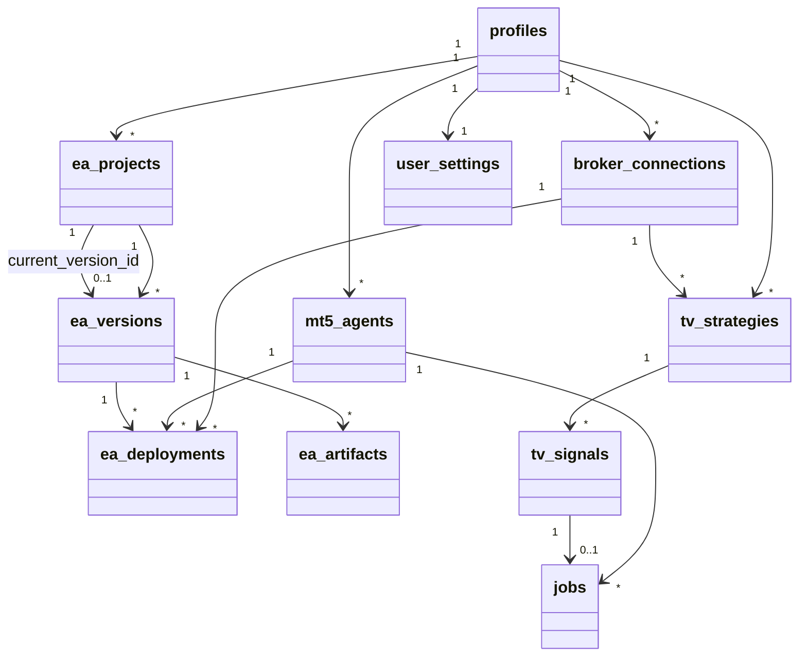
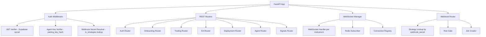
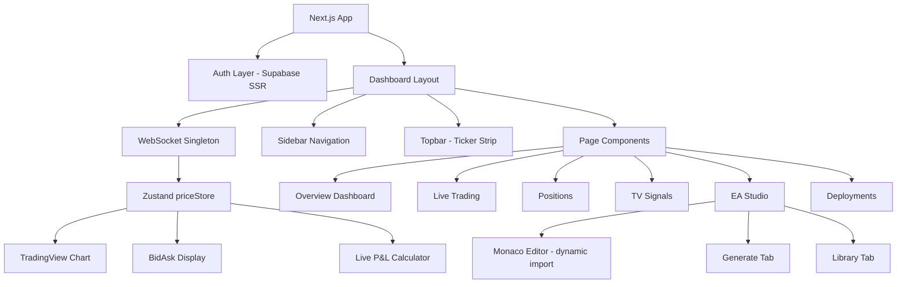
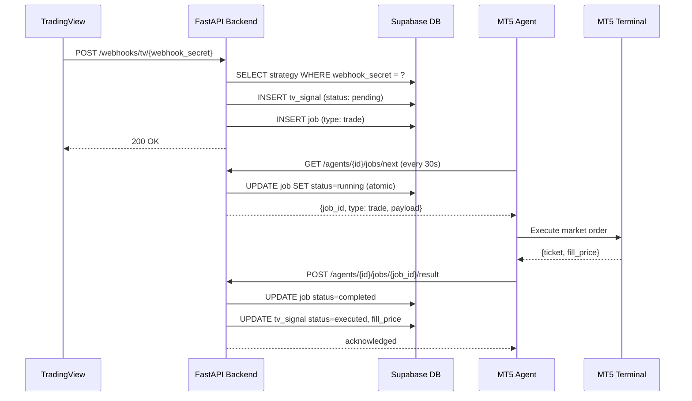
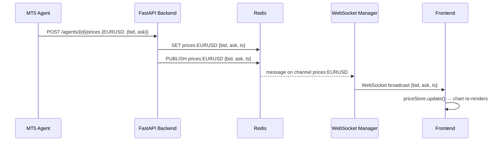

# Tech Plan — ForexElite Pro

## 1. Architectural Approach

### Core Principles

The architecture is built around three constraints: the MT5 Agent runs behind a firewall (outbound-only), all user data must be strictly isolated (RLS), and the system must be operable at MVP scale without distributed infrastructure.

### Key Decisions

| Area | Decision | Rationale |
|---|---|---|
| **Job Queue** | PostgreSQL `jobs` table as queue (no Redis queue, no Celery) | Sufficient for MVP polling frequency (30s); avoids operational complexity; atomic `SELECT … FOR UPDATE SKIP LOCKED` prevents double-pickup |
| **MT5 Agent transport** | Pull-only polling — agent calls backend, never the reverse | Agent is behind NAT/firewall; push is impossible without VPN or tunnel |
| **Price source** | MT5 Agent pushes ticks to backend via `POST /agents/{id}/prices` | MT5-only architecture; no OANDA stream; agent is the authoritative price source |
| **WebSocket broadcast** | Redis pub/sub fan-out to all connected WebSocket clients | Decouples price ingestion from client delivery; Redis already in stack for caching |
| **EA versioning** | Immutable versions — generation and compilation each produce a new version; manual edits update the current draft in-place | Non-destructive; running deployments are pinned to a specific version and unaffected by edits |
| **Webhook routing** | Per-strategy `webhook_secret` (UUID token) in URL path | Explicit routing without payload parsing; secret rotation is per-strategy; no shared secret risk |
| **Auth** | Supabase Auth issues JWTs; FastAPI verifies with `SUPABASE_JWT_SECRET`; MT5 Agent uses `X-Agent-Key` header; webhooks use URL-embedded secret | Three distinct auth surfaces, each appropriate to its caller |
| **RLS** | All user tables enforce `auth.uid() = user_id`; backend uses service role key for server-side writes | Zero-trust at the database layer; no accidental cross-user data leakage |

### Failure Modes

| Failure | Behaviour |
|---|---|
| MT5 Agent goes offline | Jobs remain `pending` in queue; frontend shows "Agent offline" banner after 10 min heartbeat gap; no data loss |
| GLM-5 API unavailable | Generation request returns `503`; frontend shows retry toast; no partial version created |
| WebSocket disconnect | Frontend reconnects with exponential backoff (1s, 2s, 4s, max 30s); Redis serves last-known price on reconnect |
| Compilation fails | `ea_versions.status` → `failed`; `compilation_error` field populated; frontend shows compiler errors dialog |
| Webhook arrives for disabled strategy | Backend returns `200` (silent discard) to prevent TradingView retry storms; signal logged with status `discarded` |

---

## 2. Data Model

### Existing Tables (used as-is)

The following tables from `file:artefacts/supabase_schema_migration.sql` are used without modification:

- `profiles` — Supabase Auth users
- `broker_connections` — MT5 account connections per user
- `ea_projects` — logical EA containers
- `ea_versions` — versioned source code (status: draft → compiling → compiled / failed)
- `ea_artifacts` — compiled `.ex5` and `.mq5` files in Supabase Storage
- `ea_deployments` — running EA instances pinned to a specific version
- `jobs` — async task queue for compile / deploy / run / stop operations
- `trade_events` — immutable audit log of all order activity
- `user_settings` — risk preferences and disclaimer acceptance

### Schema Additions

**`mt5_agents` — add `pairing_key` column**

The existing schema stores MT5 terminal credentials (`password_encrypted`) but has no field for the agent's API authentication key. A `pairing_key` column (hashed token) is added.

```sql
ALTER TABLE mt5_agents
  ADD COLUMN pairing_key_hash TEXT NOT NULL DEFAULT '',
  ADD COLUMN pairing_key_prefix TEXT NOT NULL DEFAULT '';
-- pairing_key_hash: bcrypt hash of the full key (for verification)
-- pairing_key_prefix: first 8 chars shown in UI for identification
```

**`jobs` — add `agent_id` column**

The existing `jobs` table has no reference to which agent claimed the job. This is needed to prevent cross-agent job pickup and to surface job status per agent.

```sql
ALTER TABLE jobs
  ADD COLUMN agent_id UUID REFERENCES mt5_agents(id) ON DELETE SET NULL,
  ADD COLUMN claimed_at TIMESTAMPTZ;
-- agent_id: set when agent claims the job
-- claimed_at: timestamp of claim (for timeout detection)
```

Also add `'trade'` to the `job_type` CHECK constraint to support TradingView signal execution.

**`ea_projects` — add `current_version_id` column**

Tracks which version is currently open in the editor, enabling the version dropdown in the toolbar.

```sql
ALTER TABLE ea_projects
  ADD COLUMN current_version_id UUID REFERENCES ea_versions(id) ON DELETE SET NULL;
```

**`tv_strategies` — new table**

One row per TradingView strategy configuration. Each strategy has its own webhook URL.

```sql
CREATE TABLE tv_strategies (
  id                  UUID PRIMARY KEY DEFAULT uuid_generate_v4(),
  user_id             UUID NOT NULL REFERENCES profiles(id) ON DELETE CASCADE,
  broker_connection_id UUID NOT NULL REFERENCES broker_connections(id),
  name                TEXT NOT NULL,
  webhook_secret      TEXT NOT NULL UNIQUE,  -- URL-embedded routing token
  risk_override_pct   NUMERIC(5,2),          -- NULL = inherit from user_settings
  allowed_pairs       TEXT[],                -- NULL = all pairs allowed
  is_enabled          BOOLEAN DEFAULT true,
  created_at          TIMESTAMPTZ DEFAULT NOW(),
  updated_at          TIMESTAMPTZ DEFAULT NOW()
);
-- RLS: auth.uid() = user_id (standard pattern)
CREATE INDEX tv_strategies_webhook_secret_idx ON tv_strategies(webhook_secret);
CREATE INDEX tv_strategies_user_id_idx ON tv_strategies(user_id);
```

**`tv_signals` — new table**

Immutable log of every webhook received, regardless of outcome.

```sql
CREATE TABLE tv_signals (
  id              UUID PRIMARY KEY DEFAULT uuid_generate_v4(),
  strategy_id     UUID NOT NULL REFERENCES tv_strategies(id) ON DELETE CASCADE,
  user_id         UUID NOT NULL REFERENCES profiles(id) ON DELETE CASCADE,
  symbol          TEXT NOT NULL,
  action          TEXT NOT NULL CHECK (action IN ('buy', 'sell', 'close')),
  price           NUMERIC(12,5),
  raw_payload     JSONB NOT NULL,
  status          TEXT NOT NULL DEFAULT 'pending'
                    CHECK (status IN ('pending', 'executed', 'failed', 'discarded')),
  fill_price      NUMERIC(12,5),
  broker_order_id TEXT,
  error_message   TEXT,
  job_id          UUID REFERENCES jobs(id) ON DELETE SET NULL,
  received_at     TIMESTAMPTZ DEFAULT NOW(),
  resolved_at     TIMESTAMPTZ
);
-- RLS: auth.uid() = user_id (standard pattern)
CREATE INDEX tv_signals_strategy_id_idx ON tv_signals(strategy_id);
CREATE INDEX tv_signals_user_id_idx ON tv_signals(user_id);
CREATE INDEX tv_signals_received_at_idx ON tv_signals(received_at DESC);
```

### Entity Relationships



---

## 3. Component Architecture

### Backend Components



**Auth Middleware** — Three distinct verification paths:
- User requests: verify Supabase JWT, extract `user_id`
- Agent requests: look up `pairing_key_hash` in `mt5_agents`, extract `agent_id` and `user_id`
- Webhook requests: look up `webhook_secret` in `tv_strategies`, extract `strategy_id` and `user_id`

**MT5 Agent Router** — Handles the three agent endpoints:
- `POST /agents/{id}/heartbeat` — updates `last_heartbeat`, returns any pending configuration changes
- `GET /agents/{id}/jobs/next` — atomically claims one pending job using `SELECT … FOR UPDATE SKIP LOCKED`; marks it `running` and sets `claimed_at`
- `POST /agents/{id}/jobs/{job_id}/result` — updates job status, propagates result to parent entity (version, deployment, signal)
- `POST /agents/{id}/prices` — receives price ticks, writes to Redis, triggers pub/sub broadcast

**WebSocket Manager** — Singleton per FastAPI process:
- On client connect: reads last-known price from Redis, sends immediately
- Subscribes to Redis channel `prices:{instrument}`
- On Redis message: broadcasts to all connected clients subscribed to that instrument
- On client disconnect: removes from registry; no cleanup needed

**GLM-5 Service** — Async generation pipeline:
- Receives strategy description and `project_id`
- Calls GLM-5 API with MQL5-specific system prompt
- On success: creates new `ea_version` (auto-increments `version_number`), uploads `.mq5` to Supabase Storage, creates `ea_artifact`, updates `ea_projects.current_version_id`
- On failure: returns error without creating any DB records

**Webhook Router** — Stateless per-request handler:
- Resolves `strategy_id` from URL path `webhook_secret` (indexed lookup, ~1ms)
- Checks `is_enabled`; if false, logs `discarded` signal and returns `200`
- Runs risk gate: checks daily loss limit against `user_settings`
- Creates `tv_signal` record (status: `pending`) and `job` record (type: `trade`)
- Returns `200` immediately — execution is async via MT5 Agent polling

### Frontend Components



**WebSocket Singleton** — Created once in the dashboard layout, shared across all pages:
- Connects to `ws://backend/ws/prices/{defaultPair}` on mount
- Subscribes to additional instruments as pages request them
- Feeds `priceStore` (Zustand) on every tick
- Reconnects with exponential backoff on disconnect

**EA Studio State** — Managed in a dedicated Zustand store (`eaStore`):
- Tracks: `activeProjectId`, `activeVersionId`, `editorContent`, `isDirty`, `lockState` (locked / editing)
- `isDirty` triggers unsaved-changes guard on page navigation
- Tab switches within EA Studio auto-save draft via debounced `PATCH /ea/versions/{id}` (800ms debounce)

**TanStack Query — Polling Strategy**

| Data | Refetch Interval | Rationale |
|---|---|---|
| Account balance / equity | 5 000 ms | Low-frequency financial data |
| Open positions + P&L | 1 000 ms | Live P&L requires near-real-time |
| Deployments status | 5 000 ms | EA status changes infrequently |
| TV signals feed | 10 000 ms | Supplementary to WebSocket push |
| Job status (compile) | 2 000 ms | User is waiting; fast feedback needed |
| Agent heartbeat status | 30 000 ms | Slow-changing connectivity state |

### MT5 Agent (Python Script on User's VPS)

The agent is a standalone Python script the user downloads and runs on their VPS. It has no inbound ports.

**Polling Loop:**
- Every 30 seconds: `GET /agents/{id}/jobs/next` → if job returned, execute it, `POST result`
- Every 5 minutes: `POST /agents/{id}/heartbeat` with CPU/memory metrics
- Every 1 second (when subscribed): `POST /agents/{id}/prices` with current bid/ask for active instruments

**Job Execution by Type:**

| Job Type | Agent Action |
|---|---|
| `compile` | Download `.mq5` from Storage URL, run MetaEditor compiler, upload `.ex5`, report result |
| `deploy` | Download `.ex5`, copy to `MT5/Experts/`, attach EA to chart via MT5 API |
| `run` | Start EA on specified symbol via MT5 API |
| `stop` | Remove EA from chart via MT5 API |
| `trade` | Execute market order via MT5 API with specified symbol, side, volume, SL, TP |

**Job Claiming (atomic, no double-pickup):**

The backend endpoint uses a single SQL statement to atomically claim a job:
```sql
UPDATE jobs SET status = 'running', agent_id = :agent_id, claimed_at = NOW()
WHERE id = (
  SELECT id FROM jobs
  WHERE status = 'pending' AND agent_id IS NULL
  ORDER BY created_at ASC
  FOR UPDATE SKIP LOCKED
  LIMIT 1
)
RETURNING *;
```

### End-to-End: TradingView Signal → MT5 Execution



### End-to-End: Price Tick → Frontend Chart

