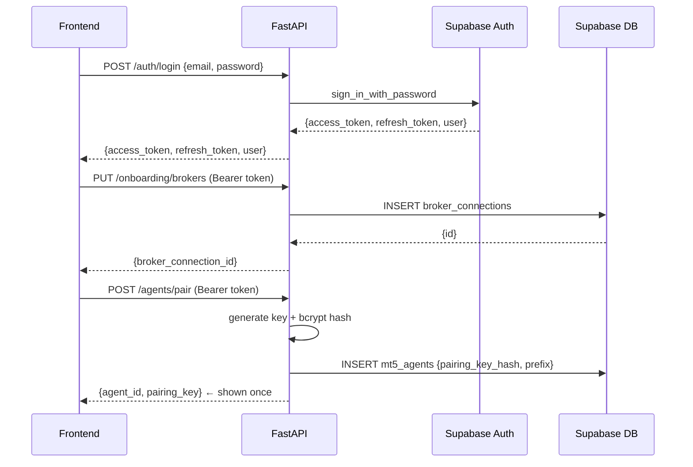

# BK2 — Auth & Onboarding API: Login, Signup, Onboarding Gate & Agent Pairing

## What

Build all auth routes, onboarding routes, the onboarding gate middleware, and the agent pairing endpoint. This unlocks every other backend ticket.

## Scope

**Auth routes (`app/api/routes/auth.py`)**
- `POST /api/v1/auth/login` — proxy to Supabase `sign_in_with_password`; return `{access_token, refresh_token, user: {id, email}}`
- `POST /api/v1/auth/signup` — proxy to Supabase `sign_up`; return `{access_token, user}`
- `POST /api/v1/auth/refresh` — proxy to Supabase `refresh_session`; return `{access_token, refresh_token}`
- All auth errors → `401` with `{"detail": "invalid_credentials"}` (never expose Supabase error messages)

**Onboarding routes (`app/api/routes/onboarding.py`)**
- `GET /api/v1/onboarding/status` — query `broker_connections` count + `user_settings.disclaimer_accepted` for current user; return `{onboarded: bool, missing: ["broker" | "preferences" | "disclaimer"]}`
- `PUT /api/v1/onboarding/brokers` — insert row into `broker_connections` (`user_id`, `broker_name`, `account_number`, `account_type`, `label`); return `{broker_connection_id}`
- `PUT /api/v1/onboarding/preferences` — upsert `user_settings` (`risk_percent`, `daily_loss_limit_pct`, `preferred_pairs`, `disclaimer_accepted`); return `{updated: true}`

**Agent pairing (`app/api/routes/agents.py` — pairing endpoint only)**
- `POST /api/v1/agents/pair` — authenticated (user JWT):
  1. Generate raw pairing key: `secrets.token_urlsafe(32)`
  2. Hash with bcrypt: `passlib.hash.bcrypt.hash(raw_key)`
  3. Extract prefix: first 8 chars of raw key
  4. Insert `mt5_agents` row: `{user_id, pairing_key_hash, pairing_key_prefix, is_connected: false}`
  5. Return `{agent_id, pairing_key}` — raw key returned **once only**, never stored in plaintext

**Onboarding gate middleware (`app/main.py`)**
- HTTP middleware on paths: `/api/v1/trading/*`, `/api/v1/ea/*`, `/api/v1/deployments/*`, `/api/v1/strategies/*`, `/api/v1/signals/*`
- Extract JWT from `Authorization: Bearer` header
- Decode user_id, query `user_settings.disclaimer_accepted` + `broker_connections` count
- If incomplete → return `428 Precondition Required` with `{"detail": "onboarding_required", "missing": [...]}`
- If no auth header → pass through (let route-level auth handle it)

## Sequence

## Acceptance Criteria
- `POST /auth/login` with valid credentials returns tokens; invalid credentials return 401
- `POST /auth/signup` creates user and returns token
- `GET /onboarding/status` returns correct `missing` array based on DB state
- `POST /agents/pair` returns raw pairing key; subsequent calls to `GET /agents/{id}` never expose the raw key
- Protected routes return 428 for users with `disclaimer_accepted = false`
- Protected routes return 428 for users with zero `broker_connections`

## Spec References
- `spec:8faa0447-2e35-4cc5-9096-0cbce32ae00a/76c33f97-1068-4ba4-9b1d-7d25ebd911bd` — Flow 1 (Auth), Flow 2 (Onboarding)
- `spec:8faa0447-2e35-4cc5-9096-0cbce32ae00a/ff9b5702-f7bb-4863-b80f-475ca098bc44` — Tech Plan §3 (Auth Middleware, Agent Pairing)
- `spec:8faa0447-2e35-4cc5-9096-0cbce32ae00a/ccad2713-2703-4e25-8dfe-6d522f7d65ca` — Schema Migration v2 (pairing_key_hash, pairing_key_prefix columns)

## Dependencies
`ticket:8faa0447-2e35-4cc5-9096-0cbce32ae00a/BK1`