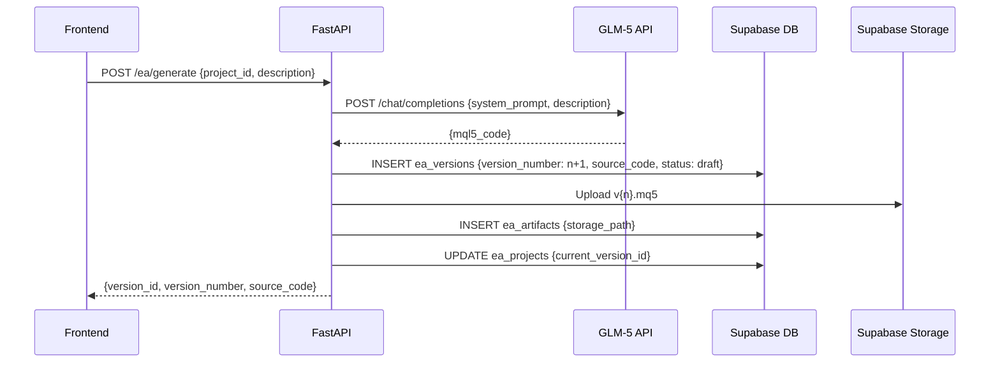

# BK4 — EA Generation API: GLM-5, Projects, Versioning, Compile & Import

## What

Build the complete EA management API: GLM-5 code generation, project/version CRUD, compile job creation, file import, and library management actions (rename, duplicate, delete).

## Scope

**EA routes (`app/api/routes/ea.py`)**

- `GET /api/v1/ea/projects` — list user's projects with `current_version_id`, version count, latest status
- `POST /api/v1/ea/projects` — create project `{name}`; return `{project_id}`

- `POST /api/v1/ea/generate` — **GLM-5 generation**:
  1. Call GLM-5 API (`GLM5_API_BASE_URL`) with MQL5 system prompt + user description
  2. On success: auto-increment `version_number` for project, create `ea_versions` row (`status: "draft"`, `source_code: <generated>`)
  3. Upload `.mq5` to Supabase Storage (`ea-artifacts/{user_id}/{project_id}/v{n}.mq5`)
  4. Create `ea_artifacts` row (type: `source`)
  5. Update `ea_projects.current_version_id`
  6. Return `{version_id, version_number, source_code}`
  7. On GLM-5 failure: return `503` — **no DB records created**

- `PATCH /api/v1/ea/versions/{version_id}` — update `source_code` (auto-save draft edits); return `{updated: true}`

- `POST /api/v1/ea/versions/{version_id}/compile` — create `jobs` row `{job_type: "compile", user_id, input_data: {version_id, storage_path}}`; return `{job_id}`

- `GET /api/v1/ea/versions/{version_id}` — return version with `status`, `version_number`, `source_code`

- `GET /api/v1/ea/versions/{version_id}/artifacts` — return artifacts with signed download URLs (Supabase Storage `create_signed_url`, 1h expiry)

- `POST /api/v1/ea/projects/{project_id}/duplicate` — copy project + latest version; name = `"{original_name} (copy)"`; return `{new_project_id}`

- `PATCH /api/v1/ea/projects/{project_id}` — rename `{name}`; return `{updated: true}`

- `DELETE /api/v1/ea/projects/{project_id}` — check for running deployments; if any → `409 Conflict {"detail": "ea_running"}`; else delete cascade

- `POST /api/v1/ea/import` — accept `multipart/form-data` with `.mq5` file + `project_name`; create project + version (`status: "draft"`) + upload to Storage + create artifact; return `{project_id, version_id}`

**GLM-5 service (`app/services/ea_generator.py`)**
- `generate_mql5(description: str, project_name: str) → str` — async HTTP call to GLM-5
- System prompt: instructs GLM-5 to output valid MQL5 code only, no markdown, no explanation
- Timeout: 60s; retry once on timeout
- Cost tracking: log token usage per generation

## GLM-5 Generation Flow

## Acceptance Criteria
- `POST /ea/generate` returns valid MQL5 code; creates version with auto-incremented `version_number`
- Regenerating on same project creates v2 without deleting v1
- `POST /ea/versions/{id}/compile` creates a `jobs` row with `job_type = "compile"`
- `DELETE /ea/projects/{id}` returns 409 if any deployment is running
- `POST /ea/import` accepts `.mq5` file and creates project + version + artifact
- Signed download URLs expire after 1 hour

## Spec References
- `spec:8faa0447-2e35-4cc5-9096-0cbce32ae00a/76c33f97-1068-4ba4-9b1d-7d25ebd911bd` — Flow 3 (EA Generation), Flow 3b (EA Library Management)
- `spec:8faa0447-2e35-4cc5-9096-0cbce32ae00a/ff9b5702-f7bb-4863-b80f-475ca098bc44` — Tech Plan §2 (EA versioning, immutable versions), §3 (GLM-5 Service)

## Dependencies
`ticket:8faa0447-2e35-4cc5-9096-0cbce32ae00a/BK2`