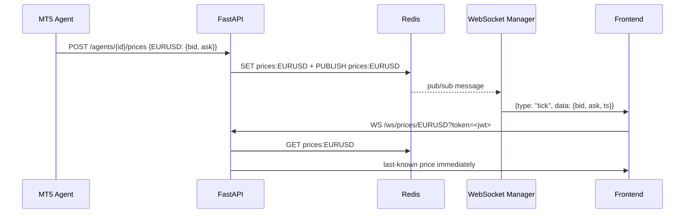

# BK5 — Trading & WebSocket API: Orders, Positions, Account, Candles & Price Streaming

## What

Build the trading API (orders, positions, account, candles) and the WebSocket price streaming endpoint that broadcasts MT5 Agent price ticks to all connected frontend clients.

## Scope

**Trading routes (`app/api/routes/trading.py`)**

- `POST /api/v1/orders` — place manual order:
  1. Validate onboarding (gate middleware handles this)
  2. Load user's `broker_connections` + `mt5_agents` (must have connected agent)
  3. Create `jobs` row `{job_type: "trade", input_data: {symbol, side, volume, sl, tp}}`
  4. **Wait synchronously** up to 10s for job completion (poll `jobs.status` every 500ms)
  5. On completion: return `{order_id, fill_price, status: "filled"}`
  6. On timeout: return `{order_id, status: "pending"}` (order may still execute)
  7. On agent offline (no heartbeat in 10 min): return `503 {"detail": "agent_offline"}`

- `GET /api/v1/positions` — create `jobs` row `{job_type: "get_positions"}`, wait up to 5s, return positions array

- `DELETE /api/v1/positions/{position_id}` — create `jobs` row `{job_type: "close_position", input_data: {ticket: position_id}}`, wait up to 10s, return `{closed_price, pnl}`

- `GET /api/v1/account` — create `jobs` row `{job_type: "get_account"}`, wait up to 5s, return `{balance, equity, margin_used, margin_available, currency, leverage}`

- `GET /api/v1/candles/{instrument}` — query params: `timeframe`, `count` (default 200):
  1. Check Redis cache `candles:{instrument}:{timeframe}` (TTL 30s)
  2. If miss: create `jobs` row `{job_type: "get_candles"}`, wait up to 10s
  3. Cache result in Redis
  4. Return OHLCV array

**WebSocket endpoint (`app/ws/price_stream.py` + `app/main.py`)**

- `WS /ws/prices/{instrument}` — JWT auth via `?token=<jwt>` query param:
  1. Verify JWT on connect; close with code 4001 if invalid
  2. Read last-known price from Redis `GET prices:{instrument}`; send immediately if exists
  3. Subscribe to Redis pub/sub channel `prices:{instrument}`
  4. On Redis message: broadcast to this WebSocket
  5. On disconnect: unsubscribe, remove from registry

- `WebSocketManager` singleton:
  - `instrument → Set[WebSocket]` connection registry
  - `connect(ws, instrument)`, `disconnect(ws, instrument)`, `broadcast(instrument, data)`
  - Redis subscriber task (asyncio background task, started in lifespan)

## WebSocket Price Flow

## Acceptance Criteria
- `POST /orders` waits up to 10s for agent job completion; returns fill price on success
- `POST /orders` returns 503 if agent has not sent heartbeat in 10 min
- WebSocket client receives last-known price immediately on connect
- WebSocket client receives price updates within 2s of agent push
- Two simultaneous WebSocket clients both receive the same tick
- `GET /candles/{instrument}` returns cached data on second call (Redis hit)

## Spec References
- `spec:8faa0447-2e35-4cc5-9096-0cbce32ae00a/76c33f97-1068-4ba4-9b1d-7d25ebd911bd` — Flow 4 (Live Trading Dashboard)
- `spec:8faa0447-2e35-4cc5-9096-0cbce32ae00a/ff9b5702-f7bb-4863-b80f-475ca098bc44` — Tech Plan §1 (Price source, WebSocket broadcast), §3 (WebSocket Manager, End-to-End sequences)

## Dependencies
`ticket:8faa0447-2e35-4cc5-9096-0cbce32ae00a/BK3`