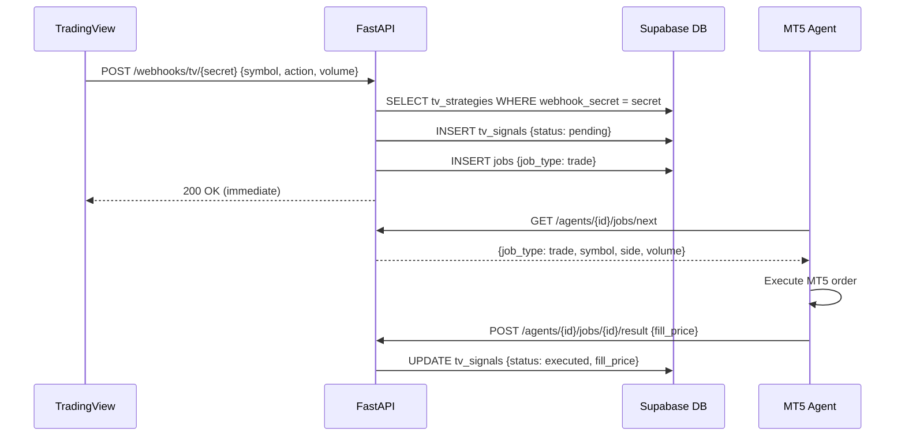

# BK6 — TradingView Webhooks & Strategies API

## What

Build the TradingView webhook receiver and the strategy management API. Each strategy has a unique `webhook_secret` that routes incoming TradingView alerts to the correct broker account.

## Scope

**Webhook endpoint (`app/api/routes/webhooks.py`)**

- `POST /api/v1/webhooks/tv/{webhook_secret}` — **unauthenticated**:
  1. Look up `tv_strategies` by `webhook_secret` (indexed column)
  2. If strategy not found → return `200` silently (no logging)
  3. If `is_enabled = false` → insert `tv_signals {status: "discarded"}` → return `200`
  4. Risk gate: check `user_settings.daily_loss_limit_pct` against today's realised P&L; if breached → insert `tv_signals {status: "discarded", error_message: "daily_loss_limit_reached"}` → return `200`
  5. Parse payload: `{symbol, action: "buy"|"sell", volume?, comment?}`
  6. Insert `tv_signals {status: "pending", raw_payload, strategy_id, user_id}`
  7. Insert `jobs {job_type: "trade", input_data: {symbol, side: action, volume, source: "tv_signal", signal_id}}`
  8. Return `200` immediately — **always 200**, never 4xx/5xx to TradingView

**Strategies routes (`app/api/routes/strategies.py`)**

- `GET /api/v1/strategies` — list user's strategies with signal counts
- `POST /api/v1/strategies` — create strategy:
  - Generate `webhook_secret = secrets.token_urlsafe(32)`
  - Insert `tv_strategies {name, user_id, broker_connection_id, risk_override_pct, allowed_pairs, webhook_secret, is_enabled: true}`
  - Return `{strategy_id, webhook_url: f"{BASE_URL}/api/v1/webhooks/tv/{webhook_secret}"}`
- `PATCH /api/v1/strategies/{id}` — update `name`, `risk_override_pct`, `allowed_pairs`, `is_enabled`; RLS ensures user owns strategy
- `DELETE /api/v1/strategies/{id}` — delete strategy + cascade to `tv_signals`

**Signals routes (`app/api/routes/signals.py`)**

- `GET /api/v1/signals` — list `tv_signals` for user, newest first, paginated (`limit=50`, `offset`)
- `GET /api/v1/signals/{signal_id}` — signal detail: `{id, strategy_name, symbol, action, status, fill_price, broker_order_id, error_message, raw_payload, created_at, resolved_at}`

**Job result propagation (in BK3's result handler)**
- When `trade` job completes and `source = "tv_signal"`: update `tv_signals.status`, `fill_price`, `broker_order_id`, `resolved_at` using **service role key** (not user JWT)

## Webhook Flow

## Acceptance Criteria
- TradingView POST → `200` returned in < 200ms (before job executes)
- Disabled strategy: signal logged as `discarded`, no job created, still returns 200
- Unknown `webhook_secret`: returns 200 silently, no DB writes
- `POST /strategies` returns unique `webhook_url` per strategy
- `GET /signals/{id}` returns `fill_price` for executed signals, `error_message` for failed
- Daily loss limit breach: signal discarded with correct `error_message`

## Spec References
- `spec:8faa0447-2e35-4cc5-9096-0cbce32ae00a/76c33f97-1068-4ba4-9b1d-7d25ebd911bd` — Flow 5 (TradingView Signal Execution)
- `spec:8faa0447-2e35-4cc5-9096-0cbce32ae00a/ff9b5702-f7bb-4863-b80f-475ca098bc44` — Tech Plan §1 (Webhook routing, failure modes), §3 (Webhook Router)
- `spec:8faa0447-2e35-4cc5-9096-0cbce32ae00a/ccad2713-2703-4e25-8dfe-6d522f7d65ca` — Schema Migration v2 (`tv_strategies`, `tv_signals` tables)

## Dependencies
`ticket:8faa0447-2e35-4cc5-9096-0cbce32ae00a/BK3`