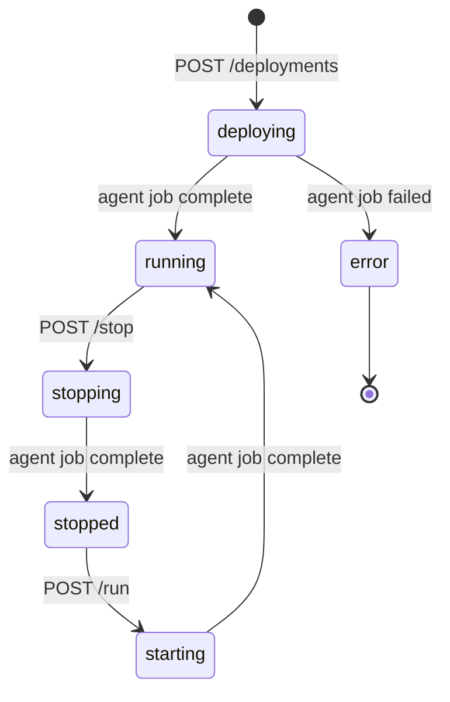

# BK7 — Deployments API: Deploy, Run, Stop & Logs

## What

Build the EA deployments API — creating deployments, controlling running state (run/stop), and retrieving execution logs.

## Scope

**Deployments routes (`app/api/routes/deployments.py`)**

- `GET /api/v1/deployments` — list user's deployments with status, EA name, version, symbol, trade count, P&L today

- `POST /api/v1/deployments` — create deployment:
  - Body: `{ea_version_id, broker_connection_id, symbol, timeframe, magic_number?}`
  - Validate: `ea_versions.status` must be `"compiled"` (cannot deploy uncompiled EA)
  - Insert `ea_deployments {ea_version_id, broker_connection_id, symbol, timeframe, status: "deploying"}`
  - Create `jobs {job_type: "deploy", input_data: {deployment_id, artifact_storage_path, symbol, timeframe}}`
  - Return `{deployment_id, job_id}`

- `POST /api/v1/deployments/{deployment_id}/run` — create `jobs {job_type: "run", input_data: {deployment_id}}`; update `ea_deployments.status = "starting"`; return `{status: "starting"}`

- `POST /api/v1/deployments/{deployment_id}/stop` — create `jobs {job_type: "stop", input_data: {deployment_id}}`; update `ea_deployments.status = "stopping"`; return `{status: "stopping"}`

- `GET /api/v1/deployments/{deployment_id}/logs` — query `jobs` table for all jobs related to this deployment; return log entries from `jobs.output_data` + `jobs.error_message` + `jobs.completed_at`, newest first, limit 100

**Deployment status state machine**

**Job result propagation (in BK3's result handler)**
- `deploy` job complete → `ea_deployments.status = "running"`
- `deploy` job failed → `ea_deployments.status = "error"`
- `run` job complete → `ea_deployments.status = "running"`
- `stop` job complete → `ea_deployments.status = "stopped"`

## Acceptance Criteria
- `POST /deployments` with uncompiled EA version returns `422` with `{"detail": "ea_not_compiled"}`
- `POST /deployments/{id}/stop` creates a `stop` job and sets status to `"stopping"`
- `GET /deployments/{id}/logs` returns log entries from all related jobs
- Deployment status transitions correctly as agent reports job results
- `GET /deployments` returns correct status for each deployment

## Spec References
- `spec:8faa0447-2e35-4cc5-9096-0cbce32ae00a/ff9b5702-f7bb-4863-b80f-475ca098bc44` — Tech Plan §3 (MT5 Agent job types: deploy/run/stop)

## Dependencies
`ticket:8faa0447-2e35-4cc5-9096-0cbce32ae00a/BK3`, `ticket:8faa0447-2e35-4cc5-9096-0cbce32ae00a/BK4`