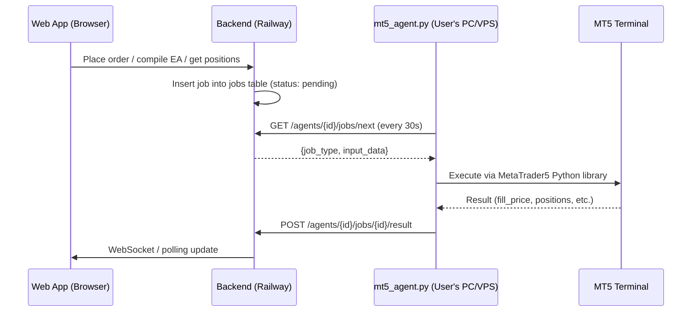
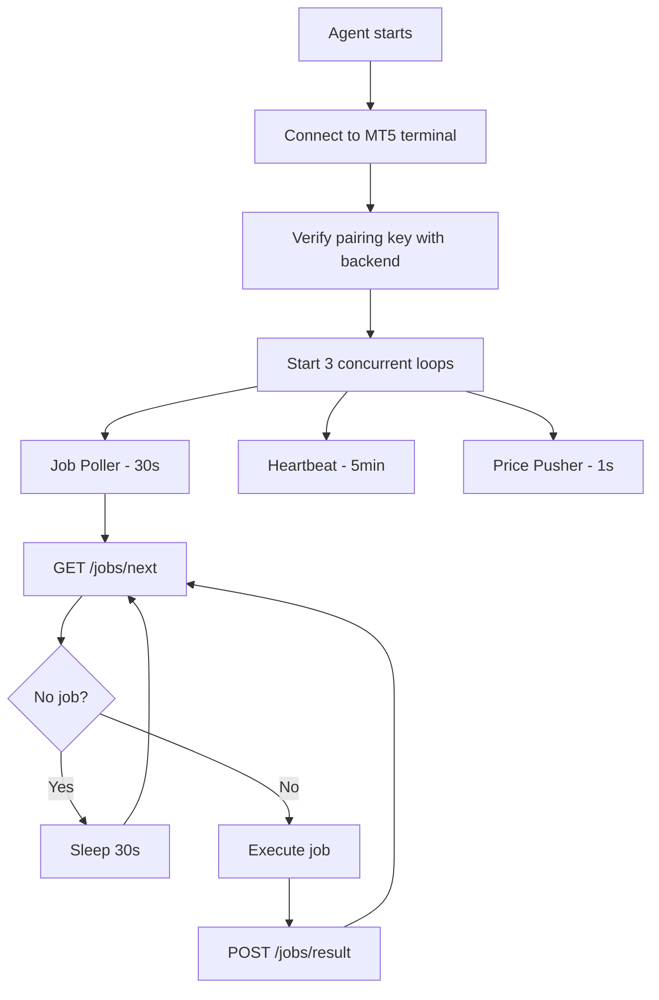

# MT5 Agent — Python Script Spec

## Overview

The MT5 Agent is a standalone Python script (`mt5_agent.py`) that the user downloads and runs on any Windows PC or VPS where MetaTrader 5 is installed. It is the **only bridge** between the user's MT5 terminal and the ForexElite Pro web app. The backend is already built to receive it — this script is the missing piece.

**It has no inbound ports. It only makes outbound HTTPS calls to our backend.**

---

## How It Fits



---

## Prerequisites

The user must have:
- **Windows PC or VPS** (Windows 10/11 or Windows Server 2016+)
- **MetaTrader 5** installed and logged into their broker account
- **Python 3.8+** installed
- The `MetaTrader5` Python package (only works on Windows, same machine as MT5)

---

## File Structure

```
mt5_agent/
├── mt5_agent.py          ← main entry point (single file, user runs this)
├── requirements.txt      ← dependencies
└── README.md             ← setup instructions
```

The agent is intentionally a **single file** — no complex project structure. The user runs one command.

---

## Setup & Launch

```bash
pip install -r requirements.txt
python mt5_agent.py --agent-id YOUR_AGENT_ID --key YOUR_PAIRING_KEY --api-url https://api.forexelite.pro
```

Or with environment variables:
```
AGENT_ID=...
AGENT_KEY=...
API_URL=https://api.forexelite.pro
```

The pairing key is shown **once** in the ForexElite Pro onboarding wizard (`POST /agents/pair`). The user copies it and pastes it here.

---

## Authentication

Every request to the backend includes two headers:
- `X-Agent-Key: <raw_pairing_key>` — verified against `bcrypt(pairing_key_hash)` in `mt5_agents` table
- `X-Agent-Id: <agent_id>` — used to look up the agent record

No JWT. No user login. The pairing key is the agent's identity.

---

## Polling Loop Design

Three concurrent loops run as asyncio tasks (or threads):

| Loop | Interval | Action |
|---|---|---|
| **Job poller** | 30 seconds | `GET /agents/{id}/jobs/next` → execute job → `POST result` |
| **Heartbeat** | 5 minutes | `POST /agents/{id}/heartbeat` with system metrics |
| **Price pusher** | 1 second | `POST /agents/{id}/prices` with current bid/ask for subscribed instruments |



---

## Job Execution — All Types

### `trade`
Execute a market order in MT5.

**Input:** `{symbol, side: "buy"|"sell", volume, sl_pips, tp_pips}`

**Steps:**
1. Get current price via `mt5.symbol_info_tick(symbol)`
2. Calculate SL/TP prices from pips
3. Call `mt5.order_send(...)` with `ORDER_TYPE_BUY` or `ORDER_TYPE_SELL`
4. On success: report `{fill_price, ticket, order_id}`
5. On failure: report error with MT5 error code

**Output:** `{fill_price: float, ticket: int, order_id: str}`

---

### `get_positions`
Fetch all open positions from MT5.

**Steps:**
1. Call `mt5.positions_get()`
2. Map each position to `{id, ticket, symbol, side, volume, open_price, current_price, sl, tp, pnl}`

**Output:** `{positions: [...]}`

---

### `get_account`
Fetch account balance and margin info.

**Steps:**
1. Call `mt5.account_info()`
2. Extract `balance`, `equity`, `margin`, `margin_free`, `currency`, `leverage`

**Output:** `{balance, equity, margin_used, margin_available, currency, leverage}`

---

### `get_candles`
Fetch OHLCV candle data for a symbol.

**Input:** `{symbol, timeframe: "M1"|"M5"|"M15"|"H1"|"H4"|"D1", count: int}`

**Steps:**
1. Map timeframe string to MT5 constant (e.g. `"H1"` → `mt5.TIMEFRAME_H1`)
2. Call `mt5.copy_rates_from_pos(symbol, timeframe, 0, count)`
3. Convert numpy array to list of `{time, open, high, low, close, volume}`

**Output:** `{candles: [...]}`

---

### `compile`
Compile an `.mq5` source file into an `.ex5` binary using MetaEditor.

**Input:** `{version_id, storage_path}` — the `.mq5` file path in Supabase Storage

**Steps:**
1. Download `.mq5` from Supabase Storage signed URL (fetched from `GET /ea/versions/{id}/artifacts`)
2. Save to MT5 `MQL5/Experts/` directory
3. Run MetaEditor compiler: `subprocess.run(["metaeditor64.exe", "/compile", filepath, "/log"])`
4. Parse compiler log for errors
5. On success: upload `.ex5` to Supabase Storage, report artifact path
6. On failure: report compiler error text

**Output (success):** `{ex5_path: str, artifact_storage_path: str}`
**Output (failure):** error with compiler log

---

### `deploy`
Copy a compiled `.ex5` to MT5 and attach it to a chart.

**Input:** `{deployment_id, symbol, timeframe, magic_number, ex5_storage_path}`

**Steps:**
1. Download `.ex5` from Supabase Storage
2. Copy to `MT5/MQL5/Experts/ForexElite/`
3. Open chart for `symbol` + `timeframe` via `mt5.chart_open()`
4. Attach EA to chart via `mt5.chart_indicator_add()` or terminal command
5. Report success

---

### `run` / `stop`
Start or stop a running EA deployment.

**Input:** `{deployment_id}`

**Steps:**
- `run`: Enable EA on the chart (set `CHART_SHOW_TRADE_LEVELS`, enable auto-trading)
- `stop`: Remove EA from chart via `mt5.chart_indicator_delete()`

---

### `close_position`
Close a specific open position.

**Input:** `{ticket: int}`

**Steps:**
1. Get position by ticket: `mt5.positions_get(ticket=ticket)`
2. Send close order: opposite direction, same volume, `ORDER_FILLING_IOC`
3. Report `{closed_price, pnl}`

---

## Price Streaming

The price pusher loop runs every 1 second and pushes bid/ask for all **subscribed instruments**.

**Subscribed instruments** = all symbols currently open in MT5 charts + any symbols from active deployments.

```python
# Every 1 second:
for symbol in subscribed_symbols:
    tick = mt5.symbol_info_tick(symbol)
    prices[symbol] = {"bid": tick.bid, "ask": tick.ask}

POST /agents/{id}/prices  body: prices
```

The backend stores each price in Redis and broadcasts to all WebSocket clients watching that instrument.

---

## Heartbeat

Every 5 minutes, the agent sends system health metrics:

```python
POST /agents/{id}/heartbeat
{
  "status": "online",
  "metrics": {
    "cpu_percent": psutil.cpu_percent(),
    "memory_percent": psutil.virtual_memory().percent,
    "active_eas": len(mt5.positions_get() or []),
    "mt5_connected": mt5.terminal_info().connected,
    "ping_ms": round(latency_ms)
  }
}
```

The backend uses `last_heartbeat` to determine agent status:
- `< 6 min` → **online** (green)
- `6–10 min` → **degraded** (amber)
- `≥ 10 min` → **offline** (red) — frontend shows "Agent offline" banner

---

## Error Handling & Reconnection

| Scenario | Behaviour |
|---|---|
| MT5 not running | Agent logs error, retries MT5 connection every 60s |
| Backend unreachable | Exponential backoff: 5s, 10s, 30s, 60s, max 5min |
| Job execution fails | Report `status: "failed"` with error message — never crash the loop |
| MT5 order rejected | Report error with MT5 `retcode` and description |
| Pairing key invalid (401) | Log error and exit — user must re-pair |
| Unhandled exception in loop | Log traceback, sleep 10s, continue loop |

---

## Dependencies (`requirements.txt`)

```
MetaTrader5>=5.0.45       # MT5 Python API (Windows only)
requests>=2.31.0          # HTTP calls to backend
psutil>=5.9.0             # CPU/memory metrics for heartbeat
python-dotenv>=1.0.0      # Load .env config file
```

No async framework needed — the agent uses simple `threading` or `time.sleep` loops. Simplicity is a feature; traders are not developers.

---

## Configuration

The agent reads config from CLI args or a `.env` file in the same directory:

| Variable | Description | Example |
|---|---|---|
| `AGENT_ID` | UUID from `POST /agents/pair` | `abc123...` |
| `AGENT_KEY` | Raw pairing key (shown once in onboarding) | `xK9mP2...` |
| `API_URL` | Backend base URL | `https://api.forexelite.pro` |
| `MT5_PATH` | Optional: path to MT5 terminal | `C:\Program Files\MetaTrader 5` |
| `LOG_LEVEL` | `INFO` or `DEBUG` | `INFO` |

---

## Logging

All output goes to stdout (visible in terminal) and optionally to `mt5_agent.log`:

```
[2026-02-24 10:32:01] INFO  Connected to MT5 terminal (EURUSD, GBPUSD, XAUUSD)
[2026-02-24 10:32:05] INFO  Heartbeat sent — status: online, CPU: 12%, RAM: 34%
[2026-02-24 10:32:35] INFO  Job claimed: compile (version_id: abc123)
[2026-02-24 10:32:41] INFO  Compile success: EMA_Scalper_v2.ex5
[2026-02-24 10:32:41] INFO  Job result posted: completed
[2026-02-24 10:33:05] INFO  Prices pushed: EURUSD 1.0845/1.0847, XAUUSD 2312.4/2312.6
```

---

## Acceptance Criteria

- Agent starts with `python mt5_agent.py --agent-id X --key Y` and connects to MT5
- Heartbeat appears in backend within 5 minutes of start; agent shows as "online" in dashboard
- `trade` job executes a real market order in MT5 and reports fill price
- `get_positions` returns live open positions from MT5
- `get_account` returns real balance/equity from MT5
- `get_candles` returns real OHLCV data for requested symbol/timeframe
- `compile` runs MetaEditor and reports success/failure with compiler output
- Price pusher sends bid/ask every 1s; frontend chart updates in real time
- Agent reconnects automatically after backend restart (exponential backoff)
- Invalid pairing key → agent exits with clear error message

---

## Delivery

The agent script is placed at `file:mt5_agent/mt5_agent.py` with `file:mt5_agent/requirements.txt` and `file:mt5_agent/README.md`. The onboarding wizard links to a download of this file with the user's `AGENT_ID` and `API_URL` pre-filled.