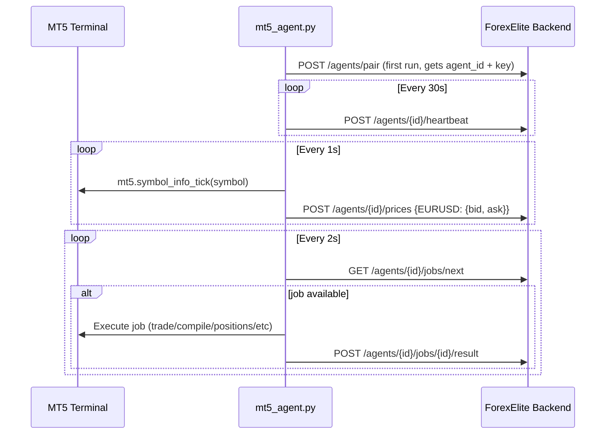

# T04 — MT5 Agent Script: mt5_agent.py

## Overview

The MT5 Agent is a Python script that users download and run on the same machine as their MetaTrader 5 terminal. It is the **only bridge** between the ForexElite Pro platform and the user's broker. Without it, no prices stream, no trades execute, no EAs compile or deploy.

Full spec: `spec:8faa0447-2e35-4cc5-9096-0cbce32ae00a/4db3e692-3ca0-449a-8fcd-becd95a3de8b`

**Output files:**
- `file:mt5_agent/mt5_agent.py` — main agent script
- `file:mt5_agent/requirements.txt` — Python dependencies
- `file:mt5_agent/README.md` — setup and usage instructions

---

## Architecture



---

## Configuration

The agent reads from a `config.json` file (created on first run) or accepts CLI arguments:

```
python mt5_agent.py --api-url https://api.forexelite.pro --key YOUR_PAIRING_KEY --agent-id YOUR_AGENT_ID
```

On first run (no `--agent-id`), the agent calls `POST /agents/pair` to register itself and saves the returned `agent_id` + `pairing_key` to `config.json`.

---

## Job Types to Implement

| Job Type | MT5 Call | Response Fields |
|---|---|---|
| `trade` | `mt5.order_send(request)` | `fill_price`, `order_id`, `ticket` |
| `close_position` | `mt5.order_send(close_request)` | `closed_price`, `pnl` |
| `get_positions` | `mt5.positions_get()` | `positions: [{ticket, symbol, type, volume, open_price, current_price, sl, tp, profit}]` |
| `get_account` | `mt5.account_info()` | `balance`, `equity`, `margin_used`, `margin_available`, `currency`, `leverage` |
| `get_candles` | `mt5.copy_rates_from_pos(symbol, timeframe, 0, count)` | `candles: [{time, open, high, low, close, volume}]` |
| `compile` | Write `.mq5` to `MQL5/Experts/`, call MetaEditor via subprocess | `compiled: true/false`, `errors: [...]` |
| `deploy` | Copy `.ex5` to `MQL5/Experts/`, attach to chart via `mt5.terminal_info()` | `deployed: true` |
| `run` | Re-attach EA to chart | `running: true` |
| `stop` | Remove EA from chart | `stopped: true` |

---

## Price Pusher

- Tracks a configurable list of symbols (default: EURUSD, GBPUSD, XAUUSD, USDJPY, AUDUSD, USDCAD)
- Calls `mt5.symbol_info_tick(symbol)` every 1 second
- Batches all symbols into a single `POST /agents/{id}/prices` call
- Skips symbols where `mt5.symbol_info_tick()` returns `None` (market closed)

---

## Heartbeat

- Sends `POST /agents/{id}/heartbeat` every 30 seconds
- Payload: `{"status": "online", "metrics": {"mt5_connected": true, "symbols_tracked": 6, "jobs_processed": 42}}`

---

## Error Handling & Reconnection

- If MT5 connection drops: retry `mt5.initialize()` every 10 seconds, log each attempt
- If API is unreachable: exponential backoff (1s, 2s, 4s, 8s, max 60s)
- If a job fails: submit result with `status: "failed"` and `error_message`
- Never crash silently — all exceptions logged with full traceback

---

## Compile Job Detail

The compile job is the most complex:
1. Receive `input_data.storage_path` — download the `.mq5` source from Supabase Storage (signed URL via `GET /ea/versions/{id}/artifacts`)
2. Write to `{MT5_DATA_PATH}/MQL5/Experts/ForexElite/{ea_name}.mq5`
3. Run MetaEditor: `subprocess.run(["metaeditor64.exe", "/compile", path, "/log", log_path])`
4. Parse the log file for errors
5. If successful, upload the `.ex5` artifact back via `POST /agents/{id}/jobs/{id}/result` with `output_data.ex5_path`

---

## `requirements.txt`

```
MetaTrader5>=5.0.45
requests>=2.32.0
python-dotenv>=1.0.0
```

---

## `README.md` Contents

- Prerequisites: Windows PC or VPS, MT5 terminal installed and logged in
- Installation: `pip install -r requirements.txt`
- First run: `python mt5_agent.py --api-url URL --key PAIRING_KEY`
- Subsequent runs: `python mt5_agent.py` (reads `config.json`)
- Running as a service: Windows Task Scheduler or NSSM instructions
- Troubleshooting: common errors and fixes

---

## Acceptance Criteria

- [ ] Agent starts, connects to MT5, and sends first heartbeat within 5 seconds
- [ ] `GET /agents/{id}/status` returns `"online"` within 60 seconds of agent start
- [ ] Price ticks appear in Redis (`prices:EURUSD`) within 2 seconds of agent start
- [ ] WebSocket clients receive price ticks in real time
- [ ] `trade` job executes a market order and returns `fill_price`
- [ ] `get_positions` job returns current open positions from MT5
- [ ] `get_account` job returns real balance, equity, margin from MT5
- [ ] `get_candles` job returns OHLCV data for the requested symbol and timeframe
- [ ] `compile` job writes MQL5 to disk, runs MetaEditor, returns success/failure
- [ ] Agent recovers automatically after MT5 restart (within 30 seconds)
- [ ] Agent recovers automatically after API downtime (exponential backoff)
- [ ] `config.json` is created on first run and reused on subsequent runs
- [ ] `README.md` covers installation, first run, and troubleshooting